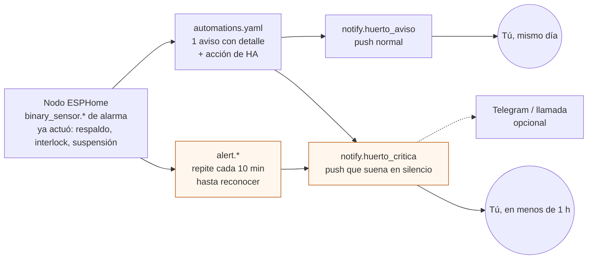

# Home Assistant: el cerebro que avisa

**En una línea:** Home Assistant OS corre dentro de casa en un mini PC (o Pi 5) con UPS,
recibe los nodos ESPHome por API cifrada y, con los tres archivos de `firmware/homeassistant/`,
convierte cada watchdog del catálogo L0 en una alarma con severidad y canal, muestra en un
solo panel lo que está fuera de banda, vigila los kWh del mes y guarda la bitácora rápida;
nada de esto es requisito para que el agua circule.

!!! info "Antes de empezar"
    - **Tiempo:** 2–3 h para instalar HA OS, integrar los nodos e importar los YAML ([guía paso a paso](../guias/configurar-home-assistant.md)); 20 min al mes para actualizar y probar · **Costo:** software $0; cerebro mini PC ThinkCentre usado i5/8 GB/SSD **~$3,000 aprox.** ([Mercado Libre](https://listado.mercadolibre.com.mx/mini-pc-lenovo-thinkcentre)) o Raspberry Pi 5 4 GB **$3,069** verificado ([Cyberpuerta](https://www.cyberpuerta.mx/Placas-de-Desarrollo-Raspberry/)) + fuente oficial 27 W ~$404 aprox.; UPS chico para cerebro + router **~$900 aprox.** en Fase 1 ([`bom/fase1.csv`](https://github.com/AndresIslas99/HomeGreen/blob/main/bom/fase1.csv)) y DataShield DS-600 **$1,189** verificado en Fase 2, o KS800PRO **$1,859** si quieres NUT ([`bom/fase2.csv`](https://github.com/AndresIslas99/HomeGreen/blob/main/bom/fase2.csv), [research/eléctrico §3.4](../research/electrico-respaldo-seguridad.md)); medidor de enchufe Steren HER-432 **$336–399** para el consumo base ([research/puntos-ciegos](../research/puntos-ciegos.md)) · **Personas:** 1
    - **Necesitas:** router Wi-Fi de 2.4 GHz con cobertura en el patio, cable de red al cerebro, teléfono con la app de Home Assistant, laptop, los tres YAML de [`firmware/homeassistant/`](https://github.com/AndresIslas99/HomeGreen/tree/main/firmware/homeassistant) y los nodos ya flasheados.
    - **Prerequisitos:** [Software](index.md) (arquitectura, red, versiones), [Firmware ESPHome](firmware.md) (nodos y entidades), [Diseño de control](../diseno/control.md) (qué corre dónde), [Diseño de datos §2](../diseno/datos.md) (nombres de entidades). Guías: [Configurar Home Assistant](../guias/configurar-home-assistant.md), [Flashear ESPHome](../guias/flashear-esphome.md).

## Qué hace HA y qué no

| Hace | No hace (lo hace el nodo o el cableado) |
|---|---|
| Avisa con severidad y canal ([06 §Escalamiento](../referencia/06-validacion-y-lazos-agenticos.md)) y **repite** las críticas cada 10 min hasta que las atiendes | Regar, ventilar, dosificar, arrancar la bomba de respaldo: eso corre en ESPHome aunque HA esté apagado |
| Decide el **modo ahorro 15/15** con batería < 12.9 V sin red | Ciclar la bomba: lo hace el nodo (`switch.modo_ahorro_15_15`) |
| Vigila lo que necesita historia: sonda sin cambio en 24 h, deriva de dosificación vs 7 días, HR alta 6 h, riego sin efecto, kWh del mes | El salto de pH > 1.5 en 5 min, el tope de dosis/día, el flujo < 2 L/min por 60 s: watchdogs locales del nodo |
| Recordatorios: calibración quincenal, cambio de solución, simulacro V11, export dominical | Mantener el agua corriendo: K1 NC + batería en paralelo ([03 §2.3](../referencia/03-instalacion.md)) |
| Dashboard de excepciones, bitácora rápida, historial y export para el agente L3 | Cambiar setpoints solo: los cambias tú y los commiteas ([control.md](../diseno/control.md)) |

## Los tres archivos

| Archivo | Qué contiene | Dónde va en HA |
|---|---|---|
| [`configuration-snippets.yaml`](https://github.com/AndresIslas99/HomeGreen/blob/main/firmware/homeassistant/configuration-snippets.yaml) | Paquete: `input_boolean` (mantenimiento NFT/riego, simulacro V11), `input_number` (alarma 220 kWh, potencias, factores), fechas de mantenimiento, formulario de bitácora, sensores `template` (humedad mínima, excepciones activas, autonomía, proyección de energía, nodo caído), `statistics` (rango 24 h de pH/EC, promedio 7 d de mL), `integration` + `utility_meter` (kWh diario y mensual), grupos `notify.huerto_aviso` / `huerto_critica` y seis `alert:` | `/config/packages/huerto.yaml` + `homeassistant: packages: !include_dir_named packages` en `configuration.yaml`. Los bloques comentados (`recorder`, `influxdb`, Telegram) se pegan en `configuration.yaml` |
| [`automations.yaml`](https://github.com/AndresIslas99/HomeGreen/blob/main/firmware/homeassistant/automations.yaml) | 28 automatizaciones: continuidad NFT, sondas y dosificación, riego y ambiente, energía, calendario de mantenimiento, resumen 07:00, bitácora, arranque de HA y UPS | `/config/automations.yaml` (o `automation huerto: !include …`) → Recargar automatizaciones |
| [`dashboard-huerto.yaml`](https://github.com/AndresIslas99/HomeGreen/blob/main/firmware/homeassistant/dashboard-huerto.yaml) | Panel "Huerto" con 5 vistas y 43 tarjetas nativas (sin HACS): Excepciones, Microgreens, NFT, Energía, Bitácora | Ajustes → Paneles → nuevo panel → editor de configuración sin formato → pegar |

Los tres se validaron con PyYAML y con un chequeo cruzado de todas las entidades que
referencian contra los `name:` de los YAML de ESPHome (160 entidades) y los helpers, sensores
derivados y alertas del paquete: ninguna huérfana. Personaliza lo marcado `TU_`: `notify.mobile_app_TU_CELULAR` y el
consumo base del hogar.

## Instalar Home Assistant OS

| Cerebro | Precio | Cuándo | Notas |
|---|---|---|---|
| Mini PC Lenovo ThinkCentre usado i5 / 8 GB / SSD | ~$3,000 aprox. ([ML](https://listado.mercadolibre.com.mx/mini-pc-lenovo-thinkcentre)) | Recomendado si vas a poner InfluxDB + Grafana y después cámaras (Frigate, ESP32-CAM) | HA OS "generic x86-64" instalado en el SSD; arranque UEFI |
| Raspberry Pi 5 4 GB | $3,069 verificado ([Cyberpuerta](https://www.cyberpuerta.mx/Placas-de-Desarrollo-Raspberry/)); 2 GB $1,879; 8 GB $4,259 en [AG Electrónica](https://agelectronica.com) | Menor consumo; suficiente para HA + ESPHome | Fuente oficial 27 W (~$404 aprox.); microSD de calidad o NVMe; caja con ventilación |

Reglas que no cambian con el hardware ([03 §1.3](../referencia/03-instalacion.md), [07 §10](../referencia/07-puntos-ciegos-y-riesgos.md)):

1. **Dentro de casa, nunca en el túnel** (HR 70–89 % en lluvias; robo). A la intemperie solo van nodos de $150.
2. **Cable de red al router** y **reserva DHCP** para el cerebro y cada nodo; el Wi-Fi de 2.4 GHz es para los ESP32.
3. **UPS para cerebro + router:** sin internet no hay alarmas. DS-600: 45–90 min con 25–35 W de carga, suficiente para avisar y apagar limpio.
4. **Consumo del cerebro ≈ 15–30 W** `[POR VERIFICAR: medir con el HER-432; entra al helper de energía]`.

Pasos exactos, con criterio de listo: [Configurar Home Assistant](../guias/configurar-home-assistant.md).

## Integrar los nodos ESPHome

1. **Add-on ESPHome** (Ajustes → Complementos → Tienda): compila y flashea por OTA desde el navegador; su editor de *Secrets* guarda las claves de [`secrets.example.yaml`](https://github.com/AndresIslas99/HomeGreen/blob/main/firmware/esphome/secrets.example.yaml).
2. **Integración ESPHome** (Ajustes → Dispositivos e integraciones): descubre `nodo-riego-v1`, `nodo-nft-v2` y `nodo-ambiente` por mDNS; pide la **clave API** de ese nodo si no la toma del add-on. Un nodo que aparece en la red pero no en HA casi siempre es clave distinta ([firmware.md → problemas](firmware.md)).
3. **Nombres de entidades:** los YAML no llevan `friendly_name`, así que el `entity_id` es el `name` en minúsculas con espacios, guiones y puntos convertidos a `_` (`Humedad sustrato N1` → `sensor.humedad_sustrato_n1`; `pH calibracion V en buffer 4.01` → `number.ph_calibracion_v_en_buffer_4_01`). Tabla completa en [datos.md §2](../diseno/datos.md) `[POR VERIFICAR: confirmar en HA los entity_id tras el primer arranque de cada nodo; si difieren, corrige los tres YAML de HA en el mismo commit]`.

### Mapeo de entidades que usan las automatizaciones y el dashboard

| Nodo | `name:` en ESPHome → `entity_id` en HA | Para qué lo usa HA |
|---|---|---|
| riego v1 | `Humedad sustrato N1…N4` → `sensor.humedad_sustrato_n1…n4`; `Etapa nivel 1…4` → `select.etapa_nivel_1…4` | `sensor.humedad_sustrato_min` (el nivel más seco en germinación/desarrollo), riego sin efecto, resumen |
| riego v1 | `Temperatura ambiente`, `Humedad ambiente`, `Punto de rocio ambiente` → `sensor.*` | HR alta 6 h, helada, mín/máx 24 h |
| riego v1 | `Nivel tinaco`, `Nivel tinaco litros`, `Temperatura tinaco` → `sensor.*` | Tinaco < 40 % (advertencia) y < 20 % (`alert.tinaco_critico`) |
| riego v1 | `Tinaco bajo`, `Tinaco critico`, `Riego saturado`, `HR alta`, `Riesgo de helada`, `Nodo riego estado` → `binary_sensor.*` | Disparadores; `nodo_riego_estado` OFF 10 min → `binary_sensor.nodo_riego_caido` → `alert` |
| riego v1 | `Bomba riego`, `Ventilador`, `Luces T8`, `Reserva K4`, `Riego automatico`, `Ventilacion forzada cada hora` → `switch.*` | Energía estimada, temporada de lluvia, tapete en helada, mantenimiento riego |
| riego v1 | `Ciclos de riego hoy` → `sensor.ciclos_de_riego_hoy`; `Estado riego` → `text_sensor.estado_riego` | `sensor.riego_ciclos_dia` (ayer = `last_period`), panel de excepciones |
| NFT v2 | `pH NFT`, `EC NFT`, `Temperatura solucion`, `Flujo NFT`, `Volumen NFT acumulado`, `Voltaje bateria NFT` → `sensor.*` | Rango 24 h (sonda plana), bomba sin flujo, autonomía, agua por semana |
| NFT v2 | `Red CFE presente`, `NFT sin flujo`, `NFT emergencia`, `Bateria baja`, `Dosificacion suspendida`, `pH/EC fuera de banda`, `Solucion caliente`, `Nivel tambo bajo/alto`, `Nodo NFT estado` → `binary_sensor.*` | Corte, respaldo, escalación (`alert.nft_emergencia`), modo ahorro, suspensión |
| NFT v2 | `Bomba NFT`, `Bomba NFT respaldo`, `Modo ahorro 15-15`, `Sonda confiable`, `Dosificacion automatica`, `Respaldo automatico por flujo`, `Modo calibracion` → `switch.*` | Acciones de HA: respaldo, ahorro, suspender sonda, modo mantenimiento |
| NFT v2 | `Dosis hoy`, `mL dosificados hoy A/B/pH`, `Tiempo en bateria actual`, `Duracion ultimo corte` → `sensor.*` | Deriva > 2× promedio 7 d, avisos de corte, V11 |
| NFT v2 | `Rearmar alarma de flujo`, `Rearmar dosificacion`, `Purgar tambo`, `Llenar tambo` → `button.*`; `Flujo minimo`, `Bateria voltaje bajo`… → `number.*` | Dashboard; `number.flujo_minimo` es el umbral del segundo disparo de "sin flujo" |
| ambiente (opcional) | `Temperatura tunel`, `Humedad tunel`, `VPD tunel`, `HR alta tunel`… (`lugar` = `tunel`) | Solo dashboard/historial; agrégalo a las vistas si lo montas |

## Importar los YAML

Orden obligatorio (el paquete define lo que usan los otros dos):

1. `configuration-snippets.yaml` → `/config/packages/huerto.yaml`; línea `packages:` en `configuration.yaml`; **Herramientas para desarrolladores → YAML → Comprobar configuración** debe decir "Configuración válida"; reinicia.
2. Sustituye `mobile_app_TU_CELULAR` por tu servicio real (Herramientas para desarrolladores → Acciones → escribe `notify.mobile_app`).
3. `automations.yaml` → recargar automatizaciones; en Ajustes → Automatizaciones deben aparecer 28 con prefijo `NFT ·`, `RIEGO ·`, `AMBIENTE ·`, `ENERGÍA ·`, `MANTENIMIENTO ·`, `RESUMEN ·`, `DATOS ·`, `BITÁCORA ·`, `CEREBRO ·`.
4. `dashboard-huerto.yaml` → panel "Huerto". Una tarjeta en rojo = entidad con otro nombre.
5. Primer día: fija las tres fechas de mantenimiento (o pulsa los botones "Hoy …"), escribe el consumo base del hogar, crea el calendario local `huerto` y la notificación a archivo `notify.bitacora_ha` (integración *File*, ruta `/config/bitacora/ha-eventos.csv`).

## Notificaciones al teléfono

=== "App de Home Assistant (obligatoria)"

    - Instala la app, inicia sesión contra tu HA y activa notificaciones. Aparece `notify.mobile_app_<nombre_del_teléfono>`.
    - El paquete crea dos grupos: `notify.huerto_aviso` (advertencias e info) y `notify.huerto_critica` (críticas). Las críticas llevan `interruption-level: critical` con sonido al 100 % (iOS) y canal `Huerto critica` con importancia alta (Android): **suenan aunque el teléfono esté en silencio** ([research §5.2](../research/electrico-respaldo-seguridad.md)).
    - En Android, tras la primera crítica, ve a los ajustes de notificación de la app y confirma que el canal "Huerto critica" tiene sonido y no está bloqueado por "No molestar".
    - Segunda persona: agrega su `mobile_app_…` a los grupos.
    - Prueba: Herramientas para desarrolladores → Acciones → `notify.huerto_critica` con `data: {push: {interruption-level: critical}}`. *Criterio de listo:* llega en < 10 s y suena con el teléfono en silencio.

=== "Telegram (opcional, para críticas)"

    Canal independiente de la app: si la app se desloguea o el teléfono cambia, Telegram sigue. Crea el bot con @BotFather, guarda el token en `secrets.yaml`, averigua tu `chat_id`, descomenta el bloque al final de `configuration-snippets.yaml` y agrega `telegram_huerto` al grupo `huerto_critica` `[POR VERIFICAR: en versiones recientes de HA el bot se configura desde Ajustes → Integraciones y el envío es la acción telegram_bot.send_message; si tu HA aún acepta YAML, el bloque comentado funciona tal cual]`.

=== "Llamada (opcional)"

    [06 §Escalamiento](../referencia/06-validacion-y-lazos-agenticos.md) admite llamada vía Twilio, CallMeBot o similar para las críticas. No está configurada en este repo: el push repetido con nivel crítico + Telegram es el mínimo del proyecto ([control.md](../diseno/control.md)) `[POR VERIFICAR: solo si en el V3 el push crítico no te despierta; cotiza el servicio antes]`.

## UPS del cerebro y NUT

| UPS | Puerto de datos | Cómo se entera HA de un corte en casa |
|---|---|---|
| DataShield DS-600 ($1,189, `bom/fase2.csv`) o "UPS chico" ~$900 de Fase 1 | No | El nodo NFT (GPIO23, bus de batería) reporta el corte del **patio**; HA manda "Home Assistant arrancó" si el corte agotó el UPS. Suficiente para el proyecto |
| DataShield KS800PRO ($1,859) | Sí (USB) | Add-on **Network UPS Tools (NUT)** + integración NUT: `sensor.ups_status_data` = `OL` (red) / `OB` (batería). La automatización `CEREBRO · ADVERTENCIA · UPS de la casa en batería` avisa que tienes 45–90 min `[POR VERIFICAR: nombre exacto de la entidad y driver del UPS en el add-on (usbhid-ups suele funcionar)]` |

Un UPS de PC **nunca** respalda la bomba del NFT (4–8 min con 450 W): la bomba vive en el bus
de batería ([Armar el respaldo DC](../guias/armar-respaldo-dc.md)).

## Copias de seguridad

- **HA OS:** Ajustes → Sistema → Copias de seguridad. Programa una copia automática semanal (las versiones recientes lo permiten con cifrado y copia a red o nube; si la tuya no, copia manual cada domingo antes de actualizar) y **descárgala al menos una vez al mes** a la laptop o a una USB: un SSD muerto no debe costarte el historial ni las claves API.
- **Lo que vive en Git ya está respaldado:** los YAML de `firmware/`, la bitácora y los informes. Lo que no: `secrets.yaml`, la base de datos del `recorder` y los helpers con estado (fechas de mantenimiento). Por eso la copia de HA.
- **Antes de actualizar HA o ESPHome:** copia de seguridad, domingo después del informe, nunca la víspera de una entrega ni con un corte en curso ([index.md](index.md)).

## Tabla de automatizaciones

Severidad y canal de [06 §Escalamiento](../referencia/06-validacion-y-lazos-agenticos.md); lo que
dice "nodo" ya lo hizo el firmware y HA solo confirma/avisa.

| Automatización (`alias`) | Disparo | Severidad · canal | Acción de HA | Fuente |
|---|---|---|---|---|
| NFT · bomba sin flujo → respaldo | `binary_sensor.nft_sin_flujo` ON (nodo: bomba ON y < 2 L/min por 60 s) o flujo < `number.flujo_minimo` 2 min con bomba ON | Crítica · push crítico + `alert.nft_sin_flujo` cada 10/30/60 min | `switch.bomba_nft_respaldo` ON (confirma), notificación con estado, red y voltaje | research §5.2 #1; 06 watchdogs |
| NFT · corte de CFE | `binary_sensor.red_cfe_presente` OFF 30 s | Advertencia · push | Aviso con V_bat y autonomía restante; marca si hay simulacro | research §5.2 #2 |
| NFT · regresó la luz | `red_cfe_presente` ON 30 s | Info · push | Apaga modo ahorro, aviso con `Duracion ultimo corte`; si V11 en curso, evalúa "sin falso sin flujo", registra y fecha el simulacro | 06 corte de luz; 07 §2; V11 |
| NFT · batería baja en corte → modo ahorro | `binary_sensor.bateria_baja` ON (12.9 V, 5 min) y red OFF | Advertencia · push | `switch.modo_ahorro_15_15` ON (el nodo cicla 15/15 ≈ 2.5 días) | research §5.2 #4 |
| NFT · batería baja con red | `bateria_baja` ON 30 min con red ON | Advertencia · push | Aviso: cargador, perfil LiFePO4, F0/S1 | armar-respaldo-dc |
| Escalación corte + sin flujo | `binary_sensor.nft_emergencia` ON | **Crítica** · `alert.nft_emergencia` cada 10 min + Telegram | Repite hasta reconocer; instrucciones de riego manual por gravedad | research §5.2 #3 |
| Nodo caído (riego / NFT) | `binary_sensor.nodo_*_caido` (estado OFF o `unavailable` 10 min) | Crítica · `alert.nodo_*_caido` cada 10 min | Repite; `done_message` al volver | 06 watchdogs (10 min) |
| NFT · sonda sin cambio 24 h | pH (rango 24 h < 0.05 con mL de pH−) o EC (< 0.02 con mL de A) | Crítica · push + `alert.dosificacion_suspendida` | `switch.sonda_confiable` OFF → el nodo suspende; rearme manual tras calibrar | 06 watchdogs |
| Dosificación suspendida | `binary_sensor.dosificacion_suspendida` ON (sonda no confiable o tope de dosis) | Crítica · `alert` cada 10 min, luego 60, luego 240 | Repite con `Estado dosificacion` | control.md Lazo 2 |
| NFT · deriva de dosificación | mL de hoy > 2× promedio de 7 días cerrados (≥ 3 días de referencia) | Advertencia · push | Aviso (fuga, sonda mintiendo, depósito contaminado) | 06 watchdogs |
| NFT · pH o EC fuera de banda 2 h | `ph_/ec_fuera_de_banda` ON 2 h | Advertencia · push | Aviso con la corrección manual (no hay pH+ ni dilución automática) | control.md Lazo 2 |
| NFT · solución caliente | `solucion_caliente` ON 30 min (> 25 °C) | Advertencia · push | Aviso: sombra, cambio de solución hoy | hidraulico §6 |
| NFT · modo mantenimiento | `input_boolean.modo_mantenimiento_nft` ON/OFF/2 h | Info · push | ON: apaga dosificación y respaldo automático en el nodo; OFF: los regresa; 2 h: recordatorio | calibrar-sondas, cambiar-solucion |
| RIEGO · tinaco < 40 % | `binary_sensor.tinaco_bajo` ON 10 min | Advertencia · push | Aviso con litros | 06 §L0 |
| Tinaco crítico < 20 % | `binary_sensor.tinaco_critico` ON (interlock del nodo) | Crítica · `alert.tinaco_critico` cada 10 min | Repite hasta rellenar (rearme a 25 %) | 06 §L0 |
| AMBIENTE · HR alta 6 h | `binary_sensor.hr_alta` ON 6 h | Advertencia · push | Aviso con ventilador/forzado; revisar cortinas, densidad, V8 | 06 §L0 |
| RIEGO · saturado | `binary_sensor.riego_saturado` ON | Advertencia · push | Aviso: sensor seco para siempre, boquilla, línea | 06 §L0 |
| RIEGO · dos riegos sin subida | tras cada ciclo, humedad mínima no subió ≥ 3 % dos veces | Advertencia · push | Aviso (contador `riegos_sin_efecto`) `[POR VERIFICAR: umbral en V3]` | fase-1/automatizacion-v1 §5 |
| AMBIENTE · helada | `riesgo_de_helada` ON 10 min (< 6 °C) | Advertencia · push | Aviso; enciende `switch.reserva_k4` si el tapete está en K4; lo apaga 30 min después de pasar | 02 §1 |
| AMBIENTE · temporada de lluvia | 00:10 diario, mes jun–sep | Info · push (al cambiar) | `switch.ventilacion_forzada_cada_hora` ON el 1-jun y OFF el 1-oct | 06 §L0 |
| RIEGO · modo mantenimiento | `input_boolean.modo_mantenimiento_riego` | — | `switch.riego_automatico` OFF/ON | — |
| ENERGÍA · sobre 220 kWh | acumulado (huerto + refri + hogar) > umbral, o proyección > umbral desde el día 7 | Advertencia · push | Aviso con acumulado y proyección | 07 §1 |
| MANTENIMIENTO · recordatorios | 08:00 diario: calibración ≥ 15 d, solución ≥ 21 d, simulacro ≥ 30 d | Advertencia · push | Aviso con la guía que toca | 06 §Resumen; 03 §2.2 |
| MANTENIMIENTO · botones "Hoy …" | `input_button.*_hecho_hoy` | — | Pone la fecha de hoy en su `input_datetime` | — |
| MANTENIMIENTO · calendario | evento de `calendar.huerto`, 1 h antes | Info · push | Aviso con el título del evento `[POR VERIFICAR: crear el calendario local "huerto"]` | 06 §Resumen |
| RESUMEN · 07:00 | diario | Info · push | Excepciones activas, T/HR mín-máx, humedades, tinaco, riegos de ayer, NFT, energía, días para calibrar | 06 §L1 |
| NFT · cierre diario de mL | 00:05 | — | Guarda `last_period` del día como muestra del promedio de 7 días | 06 watchdogs |
| DATOS · export semanal | domingo 18:00 | Info · push | Checklist: CSV de HA → `bitacora/ha/AAAA-Www.csv`, `kpis.py`, `informe_semanal.py` | 06 §L3; datos.md §5 |
| BITÁCORA · guardar | `input_button.bitacora_guardar` | — | Fila CSV (fecha, evento, siembra_id, variedad, cantidad, pH, EC, T, HR, tinaco, observaciones) → `notify.bitacora_ha` → `/config/bitacora/ha-eventos.csv` | datos.md §1 |
| CEREBRO · HA arrancó | arranque de HA + 2 min | Info · push | Estado de nodos, red del patio, último corte | 06 corte de luz |
| CEREBRO · UPS en batería (NUT) | `sensor.ups_status_data` contiene `OB` | Advertencia · push | Aviso: 45–90 min de alertas | research §3.4 |

Las seis alertas repetitivas (`alert.nft_emergencia`, `nft_sin_flujo`, `tinaco_critico`,
`nodo_riego_caido`, `nodo_nft_caido`, `dosificacion_suspendida`) se pueden **reconocer** desde la
vista Excepciones (deja de repetir; la causa sigue ahí y queda en el historial).

## El dashboard

| Vista | Qué muestra | Para qué lazo |
|---|---|---|
| **Excepciones** | Solo lo fuera de banda: lista generada por `sensor.excepciones_activas` + una tarjeta condicional por alarma con sus rearmes, modos, alertas reconocibles y el logbook de 24 h | L1: 10 min al día, dirigido por excepciones ([06 §L1](../referencia/06-validacion-y-lazos-agenticos.md)) |
| **Microgreens** | 4 carátulas de humedad por nivel, estado del riego, etapas por nivel, T/HR/punto de rocío, tinaco, luces, gráficas 24–48 h, setpoints del nodo, diagnóstico | Fase 1 |
| **NFT** | pH, EC, temperatura, flujo, batería, red CFE; continuidad (bombas, ahorro, corte), dosificación (estado, mL, deriva), tambo (purga/llenado), calibración, setpoints, diagnóstico | Fase 2 |
| **Energía** | kWh del huerto en el mes y proyección casa + huerto contra 220 kWh; potencias por actuador; explicación DAC | 07 §1 |
| **Bitácora** | Formulario de 5 campos + botón Guardar; contadores de mantenimiento con botones "Hoy …"; logbook de 7 días | L1 → L2/L3 |

Las bandas de las carátulas son las de [06 §L0](../referencia/06-validacion-y-lazos-agenticos.md)
(pH 5.8–6.2, EC 1.2–1.8 mS/cm, flujo ≥ 2 L/min, batería 12.9 V, tinaco 20/40 %); la de humedad
de sustrato (45–70 %) es la inicial del firmware `[POR VERIFICAR en el dry-run V3]`.

## Energía: el helper de 220 kWh/mes

Sin medidor, el paquete **estima** la potencia por el estado de los actuadores (bomba NFT 40 W,
luces 144 W, ventilador 25 W, bomba de riego 20 W, cerebro + nodos 20 W; todo editable en la vista
Energía) y la integra a kWh (`sensor.energia_huerto_estimada` → `sensor.energia_huerto_mes`). Con un
contacto medidor Wi-Fi (Steren SHOME-135 ~$249, se integra a HA, [research/puntos-ciegos](../research/puntos-ciegos.md))
cambias la fuente del `integration` y la estimación sobra. La alarma compara **huerto + refrigerador +
consumo base del hogar** (que mides 7 días con el HER-432) contra 220 kWh/mes y avisa también cuando la
proyección del mes lo rebasa ([07 §1](../referencia/07-puntos-ciegos-y-riesgos.md), [antes de gastar un peso](../empieza-aqui/antes-de-gastar-un-peso.md)).

## Historial y export para el agente

- `recorder`: 30 días de detalle (propuesta de [datos.md §3](../diseno/datos.md)) y fuera los voltajes crudos y señales Wi-Fi (bloque comentado en el paquete). Las estadísticas de largo plazo de HA (promedios horarios) quedan sin límite.
- **Export dominical:** Historial → selecciona las entidades de la semana (T, HR, pH, EC, riegos, dosis, alarmas) → descarga CSV → `bitacora/ha/AAAA-Www.csv` `[POR VERIFICAR: el botón de descarga del panel Historial en tu versión de HA; alternativa: consulta a InfluxDB]`. Copia también `/config/bitacora/ha-eventos.csv`. Luego `tools/informe_semanal.py` ([Herramientas CLI](herramientas-cli.md)).
- **InfluxDB + Grafana (opcional, mini PC):** bloque comentado en el paquete; el CSV semanal sigue siendo el insumo del agente L3.

## Probar antes de plantar

Cada fila es una del dry-run V3 ([validacion/v03](../validacion/v03-dry-run.md)); se acepta con el 100 % en verde.

| Inyecta | Debe pasar en HA |
|---|---|
| Desconecta el YF-S201 con la bomba NFT ON | A los 60 s (+ 20 s de gracia): push crítico "NFT SIN FLUJO", `switch.bomba_nft_respaldo` ON, tarjeta en Excepciones; `alert.nft_sin_flujo` repite a los 10 min |
| Desenchufa el cargador USB del detector de red | A los 35 s: "Corte de luz en el patio" con V_bat; al enchufar: "Regresó la luz" con la duración |
| Lo anterior + YF-S201 desconectado | `alert.nft_emergencia` cada 10 min con nivel crítico; en Telegram si lo configuraste |
| Apaga el nodo NFT (quita F3) | A los 10 min: `alert.nodo_nft_caido` repite; la bomba sigue (K1 NC) |
| Corta el Wi-Fi 30 min | Ambos nodos "caídos" a los 10 min; al volver, `done_message`; sin actuación insegura |
| Baja `Tinaco nivel minimo interlock` por encima del nivel | `alert.tinaco_critico`; `Estado riego` = "bloqueado"; la bomba no arranca ni a mano |
| Sonda pH del buffer 4.01 al 6.86 sin `Modo calibracion` | El nodo apaga `Sonda confiable`; `alert.dosificacion_suspendida` a los 0 y 10 min |
| Enciende `Mantenimiento NFT` y apaga `Bomba NFT` | No hay crítica ni respaldo; a las 2 h, recordatorio; al apagarlo, todo regresa ON |
| Enciende `Simulacro de apagón en curso` y bota el breaker 10 min | Corte + regreso + "Simulacro V11: APROBADO" (sin falso "sin flujo"); fecha del simulacro actualizada |
| Reinicia HA | "Home Assistant arrancó" a los 2 min; ninguna alarma falsa; el agua no cambió |

## Problemas frecuentes

| Síntoma | Causa probable | Qué hacer |
|---|---|---|
| "Configuración inválida" al comprobar | Sangría del paquete, `packages:` mal ubicado, `!secret` sin `secrets.yaml` | Lee la línea que marca; el paquete va completo en `packages/huerto.yaml`, no dentro de otra clave |
| Tarjetas del dashboard en rojo | `entity_id` distinto al derivado | Ajustes → Entidades → busca por nombre; corrige el YAML de HA (o renombra la entidad) y `datos.md §2` |
| Las críticas llegan sin sonido | Canal Android bloqueado o "No molestar"; en iOS falta permiso de notificaciones críticas | Ajustes de la app → canal "Huerto critica"; reinstala la app si no aparece el permiso |
| `alert.*` no repite | El grupo `huerto_critica` apunta a `mobile_app_TU_CELULAR` sin sustituir | Cambia el nombre en el paquete y recarga |
| `sensor.humedad_sustrato_min` en `unknown` | Los 4 niveles en `vacio` o nodo caído | Es correcto: sin niveles activos no hay mínimo |
| Promedio de 7 días vacío la primera semana | Necesita ≥ 3 días cerrados | La deriva se vigila desde el día 4; el tope de dosis/día del nodo cubre mientras |
| "Sonda sin cambio 24 h" en falso tras reiniciar HA | El `statistics` no tenía 24 h de datos | Ya se exige `age_coverage_ratio` > 0.9; si persiste, sube la exigencia o baja `sampling_size` |
| El UPS no aparece en NUT | Driver o cable USB | Revisa el log del add-on; prueba `usbhid-ups`; el DS-600 no tiene puerto |
| Bitácora no guarda | No existe `notify.bitacora_ha` | Integración *File* → notificación → ruta `/config/bitacora/ha-eventos.csv` → renombra la entidad |

## Al terminar

- [ ] HA OS en el cerebro, dentro de casa, con cable de red, IP reservada y en el UPS junto con el router
- [ ] Los tres nodos integrados; las entidades de [datos.md §2](../diseno/datos.md) existen con esos nombres
- [ ] Paquete, 28 automatizaciones y dashboard cargados sin errores; `mobile_app_TU_CELULAR` sustituido
- [ ] Notificación crítica de prueba suena con el teléfono en silencio; Telegram opcional probado
- [ ] Fechas de mantenimiento, consumo base del hogar y `notify.bitacora_ha` configurados; calendario `huerto` creado
- [ ] Copia de seguridad programada y una descargada a la laptop
- [ ] Tabla "Probar antes de plantar" al 100 % (es parte del V3)
- Registrar en bitácora: `bitacora/electrico.csv` con `evento = instalacion_ha` (versión de HA OS y de ESPHome en `observaciones`) y cada prueba de la tabla como `evento = prueba_alarma` con la fila probada.
- Siguiente paso: [Dry-run V3](../validacion/v03-dry-run.md) → [Simulacro de apagón](../guias/simulacro-de-apagon.md) → [Herramientas CLI](herramientas-cli.md) para el informe semanal.

## Fuentes

- [referencia/06-validacion-y-lazos-agenticos.md](../referencia/06-validacion-y-lazos-agenticos.md) — L0, watchdogs (flujo 60 s, sonda 24 h / 1.5 en 5 min, nodo 10 min, deriva 2× 7 días), escalamiento (canales y tiempos), L1, calibración quincenal, V3, V11.
- [research/electrico-respaldo-seguridad.md](../research/electrico-respaldo-seguridad.md) §3.4 (UPS, KS800PRO con NUT) y §5.2 (las 5 automatizaciones base, `alert`, modo ahorro 12.9 V, `interruption-level: critical`).
- [referencia/07-puntos-ciegos-y-riesgos.md](../referencia/07-puntos-ciegos-y-riesgos.md) §1 (DAC 250, alarma 220 kWh/mes, HER-432) y §2 (auto-recuperación, falso "sin flujo"); [research/puntos-ciegos.md](../research/puntos-ciegos.md) §(a) (potencias, SHOME-135, NB-060).
- [referencia/03-instalacion.md](../referencia/03-instalacion.md) §1.3 (HA en casa con UPS, dashboard mínimo) y §2.2–2.3.
- [research/electronica-automatizacion.md](../research/electronica-automatizacion.md) §2 (mini PC vs Pi 5, precios).
- [diseno/control.md](../diseno/control.md) (quién ejecuta qué), [diseno/datos.md](../diseno/datos.md) §2–3 y §5 (entidades, retención, export), [software/firmware.md](firmware.md) (entidades y pruebas del nodo).
- [`firmware/homeassistant/`](https://github.com/AndresIslas99/HomeGreen/tree/main/firmware/homeassistant), [`bom/fase1.csv`](https://github.com/AndresIslas99/HomeGreen/blob/main/bom/fase1.csv), [`bom/fase2.csv`](https://github.com/AndresIslas99/HomeGreen/blob/main/bom/fase2.csv).
