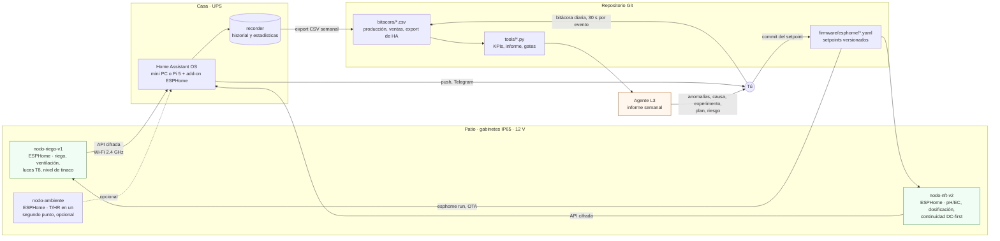

# Software: de los sensores al agente

**En una línea:** dos nodos ESP32 con ESPHome ejecutan solos los lazos que mantienen vivo
el cultivo; Home Assistant, en un mini PC con UPS dentro de casa, avisa, grafica y guarda;
la bitácora en Git y un export semanal alimentan a un agente que propone y un humano
aprueba. Ninguna de esas capas puede matar una planta si se cae: el fail-safe del agua es
físico.

!!! info "Antes de empezar"
    - **Tiempo:** 20 min de lectura; montar el cerebro toma una tarde ([Configurar Home Assistant](../guias/configurar-home-assistant.md)) y cada nodo 1 h ([Flashear ESPHome](../guias/flashear-esphome.md)). · **Costo:** software $0 (todo es libre); cerebro mini PC ThinkCentre usado ~$3,000 aprox. o Raspberry Pi 5 4 GB $3,069 verificado, UPS chico ~$900 aprox. en Fase 1 y DataShield DS-600 $1,189 verificado en Fase 2 ([`bom/fase1.csv`](https://github.com/AndresIslas99/HomeGreen/blob/main/bom/fase1.csv), [`bom/fase2.csv`](https://github.com/AndresIslas99/HomeGreen/blob/main/bom/fase2.csv)). · **Personas:** 1
    - **Necesitas:** router Wi-Fi de 2.4 GHz con cobertura en el patio, un cable USB de datos, una laptop, cuenta de GitHub.
    - **Prerequisitos:** [Diseño de control](../diseno/control.md) (qué lazo corre dónde), [Diseño de datos](../diseno/datos.md) (nombres de entidades y CSV), [Diseño eléctrico](../diseno/electrico.md) (pines y gabinetes).

## La arquitectura en un dibujo

Lectura: las flechas hacia la izquierda (setpoints, OTA) **siempre pasan por ti**. El agente
no toca el firmware ni Home Assistant; propone y tú commiteas
([06 §L3](../referencia/06-validacion-y-lazos-agenticos.md)).

## Quién manda en cada capa

| Capa ([06](../referencia/06-validacion-y-lazos-agenticos.md)) | Software | Frecuencia | Si se cae |
|---|---|---|---|
| L0 lazos de máquina | ESPHome en cada nodo: riego por histéresis, ventilación, dosificación con tiempo muerto, interlocks, watchdog de flujo, respaldo de bomba | seg–min | El nodo reinicia solo y vuelve al estado seguro; la bomba NFT sigue por el contacto NC ([control.md](../diseno/control.md)) |
| L0 alarmas y escalamiento | Home Assistant: `automations.yaml`, `alert`, notificaciones push | seg–min | Los lazos locales siguen; pierdes avisos (por eso router y cerebro van en UPS) |
| L1 operador | Dashboard de excepciones en HA + bitácora CSV | 10 min/día | — |
| L2 KPIs | `tools/kpis.py` sobre `bitacora/*.csv` | semanal | — |
| L3 agente | `tools/informe_semanal.py` arma el paquete (CSV de HA + bitácora + KPIs) y el prompt; Claude vía API o sesión de Claude Code por cron responde | semanal | Sin informe esa semana; nada se detiene |
| L4 gates | `tools/gate_audit.py` evalúa el gate contra la bitácora | por fase | — |

Regla: **una capa solo escala problemas hacia arriba, nunca los resuelve dos veces.** Si el
nodo puede corregirlo (riego, dosis), HA no lo toca; si HA lo detecta pero no lo explica
(rendimiento cayendo), lo empuja al informe del agente.

## Componentes

| Componente | Dónde corre | Versión | Archivos en el repo |
|---|---|---|---|
| **ESPHome** (firmware) | En cada ESP32; se compila desde el add-on de HA o desde tu laptop | ≥ 2025.1 (`min_version` en cada YAML); los YAML de este repo se validaron con `esphome config` y compilaron completos con `esphome compile` en ESPHome 2026.6.5 (ESP-IDF 5.5.4) | [`firmware/esphome/`](https://github.com/AndresIslas99/HomeGreen/tree/main/firmware/esphome): `nodo-riego-v1.yaml`, `nodo-ambiente.yaml`, `nodo-nft-v2.yaml`, `secrets.example.yaml` → [Firmware](firmware.md) |
| **Home Assistant OS** | Mini PC o Raspberry Pi 5 dentro de casa, en UPS | La estable vigente cuando instales `[POR VERIFICAR: anota en la bitácora la versión instalada y la de cada actualización]` | [`firmware/homeassistant/`](https://github.com/AndresIslas99/HomeGreen/tree/main/firmware/homeassistant): `automations.yaml`, `dashboard-huerto.yaml`, `configuration-snippets.yaml` → [Home Assistant](home-assistant.md) |
| Add-on **ESPHome** | Dentro de HA (compila y flashea por OTA desde el navegador) | La que ofrezca la tienda de add-ons | — |
| `recorder` + estadísticas de largo plazo | HA | — | Retención en [datos.md §3](../diseno/datos.md) |
| InfluxDB + Grafana (opcional) | Mini PC | — | Histórico largo y el dashboard que se enseña a los chefs ([datos.md](../diseno/datos.md)) |
| **Herramientas CLI** | Tu laptop o el mini PC; Python 3.11, solo biblioteca estándar | — | `tools/check_links.py`, `kpis.py`, `informe_semanal.py`, `gate_audit.py` → [Herramientas CLI](herramientas-cli.md) |
| GitHub Actions | GitHub | — | `.github/workflows/docs.yml` (publica esta wiki), `links.yml` (revisa enlaces cada semana) |
| Agente L3 | Claude vía API o Claude Code por cron | — | Contrato del informe en [06 §L3](../referencia/06-validacion-y-lazos-agenticos.md) |

## Requisitos

### El cerebro

- **Mini PC Lenovo ThinkCentre usado i5 / 8 GB / SSD (~$3,000 aprox., Mercado Libre)**:
  la opción recomendada si quieres HA + ESPHome + Grafana y, después, cámaras (Frigate,
  ESP32-CAM). Alternativa: **Raspberry Pi 5 4 GB ($3,069 verificado, Cyberpuerta)** con su
  fuente oficial ([research/electronica-automatizacion §2](../research/electronica-automatizacion.md)).
- **Dentro de casa, nunca en el túnel** (humedad del 70–89 % en lluvias). Cable de red al
  router si se puede; el Wi-Fi es para los nodos.
- **UPS para router + cerebro:** ~$900 aprox. en Fase 1; en Fase 2 el DataShield DS-600
  ($1,189 verificado) da 45–90 min con 25–35 W de carga: suficiente para que salgan las
  alertas y HA se apague limpio ([research/electrico-respaldo-seguridad §3.4](../research/electrico-respaldo-seguridad.md)).
  Sin internet no hay alarmas.
- Consumo: ≈ 15–30 W `[POR VERIFICAR: medir con un medidor de enchufe; entra al cálculo
  de la tarifa DAC de electrico.md]`.

### La red

- **Wi-Fi de 2.4 GHz** con cobertura en los gabinetes: el ESP32 no ve redes de 5 GHz. Si tu
  router está lejos del patio, un repetidor o un punto de acceso en la ventana `[POR
  VERIFICAR: la entidad "Nodo … señal WiFi" debe quedar mejor que −70 dBm con el gabinete
  cerrado; si no, mueve el AP]`.
- **Reserva DHCP (IP fija por MAC) para cada nodo** y para el cerebro: las automatizaciones y
  el OTA no deben depender de que cambie la IP.
- Los nodos anuncian `nodo-riego-v1.local`, `nodo-nft-v2.local` y `nodo-ambiente.local`
  (mDNS) y exponen un panel web local en el puerto 80: útil en el patio sin HA.
- La app de Home Assistant en tu teléfono para las notificaciones; Telegram o llamada
  (Twilio, CallMeBot o similar) para las críticas es opcional
  ([06 §Escalamiento](../referencia/06-validacion-y-lazos-agenticos.md)).

### Versiones y cuentas

- **ESPHome ≥ 2025.1.** Los YAML usan sintaxis de 2024.6 en adelante (`one_wire`,
  `ota: platform: esphome`, `attenuation: 12db`, filtro `clamp`); `min_version` lo exige al
  compilar. Framework `esp-idf` (el predeterminado para ESP32 en 2025+); `arduino` también
  compila si cambias una línea.
- **Home Assistant OS** estable. Actualiza HA y ESPHome juntos, un domingo, después del
  informe semanal y nunca la víspera de una entrega.
- **Python 3.11+** para `tools/` (sin dependencias) y para `mkdocs serve` si quieres la wiki
  en local ([Cómo usar esta guía](../empieza-aqui/como-usar-esta-guia.md)).
- Cuenta de GitHub: el repo es la memoria del proyecto (bitácora, setpoints, informes).

## Reglas de diseño del software

1. **El fail-safe es físico.** La bomba NFT principal corre por un contacto normalmente
   cerrado y `restore_mode: RESTORE_DEFAULT_ON`; los solenoides son NC. Sin ESP32, sin Wi-Fi y
   sin HA, el agua circula y el tinaco no se vacía ([electrico.md](../diseno/electrico.md)).
2. **Los nodos nunca se reinician por perder la red.** `reboot_timeout: 0s` en `wifi:` y
   `api:`: un router caído no borra el tiempo muerto de mezcla ni los contadores de riego.
3. **API cifrada y OTA con contraseña.** Las claves viven en `secrets.yaml`, que **no** se
   sube a Git ([`secrets.example.yaml`](https://github.com/AndresIslas99/HomeGreen/blob/main/firmware/esphome/secrets.example.yaml)
   explica cómo generarlas) `[POR VERIFICAR: agregar firmware/esphome/secrets.yaml al .gitignore]`.
4. **Los setpoints viven en el nodo** como `number`, `select` y `switch` de ESPHome; se
   cambian desde HA sin reflashear y se guardan en la flash del ESP32. El valor "oficial"
   se commitea después en el YAML con su evidencia ([control.md](../diseno/control.md);
   procedimiento en [Firmware → Cambiar setpoints](firmware.md#cambiar-setpoints)).
5. **Nombres de entidades fijos.** Los YAML no usan `friendly_name` para que los `entity_id`
   queden exactamente como en [datos.md §2](../diseno/datos.md) (`sensor.humedad_sustrato_n1`,
   `switch.bomba_nft`, …); si cambias un nombre, cámbialo en firmware, automatizaciones y
   dashboard.
6. **Todo se prueba antes de plantar y después cada mes.** Dry-run V3 de 72 h con fallas
   inyectadas ([validacion/v03](../validacion/v03-dry-run.md)) y simulacro de apagón V11
   ([guias/simulacro-de-apagon](../guias/simulacro-de-apagon.md)).

## De la telemetría al informe (cada domingo)

1. HA exporta la semana (T, HR, pH, EC, riegos, dosis, alarmas) a `bitacora/ha/AAAA-Www.csv`
   ([datos.md §3](../diseno/datos.md)).
2. `tools/kpis.py` calcula los KPIs L2 desde `bitacora/produccion.csv` y `ventas.csv`.
3. `tools/informe_semanal.py` arma el paquete (CSV + bitácora + KPIs + experimentos activos)
   y el prompt del contrato de [06 §L3](../referencia/06-validacion-y-lazos-agenticos.md).
4. El agente responde en ≤ 1 página: anomalías, causa probable, un experimento V6, plan de
   siembra, el riesgo de la semana. Tú apruebas o corriges; lo decidido se commitea
   (setpoint, SOP, densidad) y queda como historial.

## Páginas de esta sección

| Página | Qué resuelve | Cuándo |
|---|---|---|
| [Firmware ESPHome](firmware.md) | Tabla de pines por nodo, instalar ESPHome, flashear por USB y OTA, calibrar sensores paso a paso, cambiar setpoints, problemas frecuentes | Fase 1 S12–S15 (nodo de riego); Fase 2 (nodo NFT) |
| [Home Assistant](home-assistant.md) | Instalar HA OS, integrar los nodos, las automatizaciones de alarma y escalamiento, el dashboard de excepciones, calendario de calibración, export CSV | Fase 1 S12 en adelante |
| [Herramientas CLI](herramientas-cli.md) | `check_links.py`, `kpis.py`, `informe_semanal.py`, `gate_audit.py` | Desde la primera semana con bitácora |
| Guías: [Flashear ESPHome](../guias/flashear-esphome.md) · [Configurar Home Assistant](../guias/configurar-home-assistant.md) · [Simulacro de apagón](../guias/simulacro-de-apagon.md) · [Calibrar sondas pH/EC](../guias/calibrar-sondas-ph-ec.md) | Una tarea, una página | Con las manos en la tarea |

## Fuentes

- [referencia/06-validacion-y-lazos-agenticos.md](../referencia/06-validacion-y-lazos-agenticos.md) — capas L0–L4, watchdogs, contrato del informe L3.
- [referencia/03-instalacion.md](../referencia/03-instalacion.md) §1.3 (automatización v1, HA en casa con UPS) y §2.3 (DC-first).
- [research/electronica-automatizacion.md](../research/electronica-automatizacion.md) — cerebro (mini PC vs Pi 5), proveedores y precios.
- [research/electrico-respaldo-seguridad.md](../research/electrico-respaldo-seguridad.md) §3.4 (UPS) y §5 (YAML base y automatizaciones).
- [diseno/control.md](../diseno/control.md), [diseno/datos.md](../diseno/datos.md), [diseno/electrico.md](../diseno/electrico.md).
- [`bom/fase1.csv`](https://github.com/AndresIslas99/HomeGreen/blob/main/bom/fase1.csv) y [`bom/fase2.csv`](https://github.com/AndresIslas99/HomeGreen/blob/main/bom/fase2.csv) — partidas de automatización y UPS.
