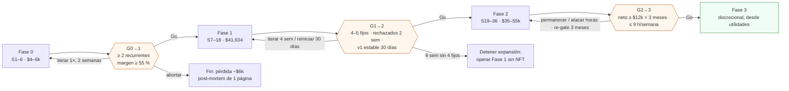

# Gates de fase (L4): G0→1, G1→2, G2→3

**En una línea:** tres compuertas medibles que liberan el dinero de la siguiente fase —2 clientes recurrentes y margen ≥ 55 %; 4–5 clientes fijos, demanda insatisfecha y 30 días de automatización estable; neto ≥ $12k/mes por 3 meses con ≤ 9 h/semana— escritas en Git antes de empezar cada fase, auditadas con `tools/gate_audit.py` contra la bitácora y firmadas por ti y por un tercero; un gate no alcanzado no se renegocia: se itera o se detiene.

!!! info "Antes de empezar"
    - **Cuándo:** al cerrar cada fase (S6, S18, S36 o cuando se cumplan los plazos de medición); las condiciones se leen y se commitean **antes** de empezar la fase · **Tiempo:** 1 h de auditoría + 1 h de decisión · **Costo:** $0 · **Personas:** 1 + un tercero que pueda leer los números (pareja, socio, contador)
    - **Necesitas:** `bitacora/ventas.csv` y `produccion.csv` al día; `embudo.csv` (G0→1); histórico de Home Assistant desde el commissioning (G1→2); `cobranza.csv`, `costos.csv`, `timesheet.csv` y recibo CFE (G2→3); Python 3.11 y `tools/gate_audit.py` ([Herramientas CLI](../software/herramientas-cli.md)); el issue del gate abierto con la tabla pegada
    - **Páginas de cada gate con su decisión detallada:** [G0→1](../fases/fase-0/gate.md) · [G1→2](../fases/fase-1/gate.md) · [G2→3](../fases/fase-2/gate.md) · **Prerequisito:** [Cómo funcionan los gates](../empieza-aqui/como-usar-esta-guia.md)

## Los tres gates, tal cual están en 06 §L4

| Gate | Métrica | Umbral | Fuente de dato | Decisión |
|---|---|---|---|---|
| **G0→1** | Clientes con ≥ 3 compras semanales consecutivas | **≥ 2** | `bitacora/ventas.csv` | Go / iterar 2 semanas más / abortar (pérdida acotada ~$6k) |
| **G0→1 (b)** | Margen variable en ventas reales | **≥ 55 %** | `bitacora/produccion.csv` + precios cobrados | Si falla: subir precio o bajar costo **antes** de invertir |
| **G1→2** | Clientes fijos + demanda insatisfecha | **4–5 fijos** y pedidos rechazados **2 semanas seguidas** | `bitacora/ventas.csv` | Go |
| **G1→2 (b)** | Automatización v1 estable | **30 días** con **< 2 alarmas críticas/semana** y **cero** pérdidas por fallo de riego | Home Assistant + `produccion.csv` | Si falla: **NO agregar NFT sobre una base inestable** |
| **G2→3** | El sistema se paga solo | Neto **≥ $12,000/mes por 3 meses** consecutivos | Contabilidad (cobrado, no facturado) | Go a "juguetes" (Fase 3) |
| **G2→3 (b)** | Horas del fundador | **≤ 9 h/semana medidas** ([V9](v09-timesheet.md), 4 semanas) | `bitacora/timesheet.csv` | Si falla: atacar el rubro más caro en tiempo antes de escalar |

Los gates se evalúan contra el **neto realista** ($6,500–11,000/mes en régimen), no contra el optimista del plan original ([07 · El número corregido](../referencia/07-puntos-ciegos-y-riesgos.md)); y aun así el umbral no baja.



## Definiciones auditables (para que un tercero pueda contar)

| Término | Definición | Fuente |
|---|---|---|
| **Cliente** | El restaurante (razón social o nombre comercial) u hogar suscrito; no el chef | [Fase 0 · Gate](../fases/fase-0/gate.md) |
| **Compra semanal** | ≥ 1 entrega en la semana ISO con `precio_unit_mxn × cantidad > 0` **y SPEI recibido**; muestras gratis, pedidos no cobrados y hogares de prueba no cuentan | ídem |
| **Consecutivas** | Semanas ISO seguidas sin hueco; una semana sin pedido reinicia la racha | ídem |
| **Cliente fijo** (G1→2) | Recurrente en el sentido de G0→1 **y** con pedido en cada una de las últimas 2 semanas | [Fase 1 · Gate](../fases/fase-1/gate.md) |
| **Demanda insatisfecha** | Pedido que no pudiste surtir, registrado el mismo día en `ventas.csv` con `cantidad` = charolas no surtidas, `precio_unit_mxn = 0`, `entregado_a_tiempo = no`, `feedback = "RECHAZADO sin capacidad"`; dos semanas ISO seguidas con ≥ 1 | ídem |
| **Alarma crítica** | Tinaco < 20 %, nodo caído, flujo cero con bomba ON, corte de luz con pérdida ([06 §escalamiento](../referencia/06-validacion-y-lazos-agenticos.md)); se cuentan por semana desde el histórico de HA | ídem |
| **Pérdida por fallo de riego** | Charola con `merma_pct > 0` y `observaciones` = "fallo de riego: …" en los 30 días; **una sola** reprueba la métrica (la regla es cero) | ídem |
| **Reloj de 30 días** | Arranca el día del commissioning del nodo (V3 aprobado); una corrección de causa raíz lo reinicia | ídem |
| **Margen variable** | (ingreso cobrado − insumos − reparto) ÷ ingreso cobrado; insumos por variedad de [08](../referencia/08-recetas-y-economia-unitaria.md); reparto $15–25 por parada prorrateado | [Fase 0 · Gate](../fases/fase-0/gate.md) |
| **Neto** (G2→3) | Ingreso **cobrado** en el mes (SPEI conciliado; una factura PPD sin cobro no es ingreso) − insumos − agua, luz (recibo CFE real), calibración y mermas − gasolina/entregas − **ayudante, si lo hay** − reposiciones por rechazo − fondo de reposición ($500/mes) | [Fase 2 · Gate](../fases/fase-2/gate.md) |
| **3 meses consecutivos** | Meses calendario seguidos, cada uno ≥ $12,000; un mes en $11,900 reinicia; enero–febrero cuentan con su −35 % real | ídem |
| **Horas medidas** | Todo lo que haces por el huerto, solo tus horas (las del ayudante ya se restaron como costo); promedio de 4 semanas seguidas sin excluir la "mala" | ídem, [V9](v09-timesheet.md) |

## Cómo auditar con `tools/gate_audit.py`

Python 3.11, solo biblioteca estándar; lee la bitácora, evalúa el gate y escribe un informe Markdown en `bitacora/gates/Gx-y-AAAA-MM-DD.md` ([Software](../software/index.md)). Opciones completas y esquemas de CSV que espera: [Herramientas CLI § `gate_audit.py`](../software/herramientas-cli.md#gate_auditpy). Agrega `--guardar` para que escriba el informe (sin esa bandera solo lo imprime); la salida del proceso es `0` = GO, `1` = NO-GO o datos insuficientes, `2` = error de uso:

```bash
# G0→1: fin de la semana 6
python3 tools/gate_audit.py --gate G0-1 \
  --ventas bitacora/ventas.csv --produccion bitacora/produccion.csv \
  --desde 2026-09-21 --hasta 2026-10-30

# G1→2: domingo de la S18 (agrega el export de HA de los 30 días)
python3 tools/gate_audit.py --gate G1-2 \
  --ventas bitacora/ventas.csv --produccion bitacora/produccion.csv \
  --ha bitacora/ha/ --desde 2027-01-11 --hasta 2027-02-14

# G2→3: fin del mes 9
python3 tools/gate_audit.py --gate G2-3 \
  --ventas bitacora/ventas.csv --cobranza bitacora/cobranza.csv \
  --costos bitacora/costos.csv --timesheet bitacora/timesheet.csv \
  --desde 2027-04-01 --hasta 2027-06-30
```

| Gate | Paso del script | Qué hace | Salida |
|---|---|---|---|
| G0→1 | 1 | Filtra `ventas.csv` con `cantidad > 0` y `precio_unit_mxn > 0`; agrupa cliente × semana ISO | Tabla cliente × semana |
| | 2 | Racha máxima de semanas consecutivas con compra por cliente | `racha_max` |
| | 3 | Métrica (a): clientes con `racha_max ≥ 3` | **PASS** si ≥ 2 |
| | 4–5 | Métrica (b): (Σ ingreso − Σ insumos − Σ reparto) ÷ Σ ingreso, con costos del 08 | **PASS** si ≥ 55 % |
| G1→2 | 1 | Clientes fijos: racha ≥ 3 **y** pedido en las últimas 2 semanas | **PASS** si ≥ 4 |
| | 2 | Filas `RECHAZADO sin capacidad` por semana | **PASS** si 2 semanas seguidas ≥ 1 |
| | 3 | Críticas por semana desde el export de HA; filas de `produccion.csv` con "fallo de riego" en 30 días | **PASS** si todas las semanas < 2 y cero pérdidas |
| G2→3 | 1–3 | Cobrado por mes (`cobranza.csv` por `fecha_cobro`) − costos por categoría (`costos.csv`) = neto × 3 meses | **PASS** si los 3 meses ≥ $12,000 |
| | 4–5 | Promedio semanal de `timesheet.csv` en las 4 últimas semanas, por rubro | **PASS** si ≤ 9 h; reporta el rubro más caro |
| Todos | apoyo | KPIs L2 de contexto vía `tools/kpis.py` (no son gate) | Tabla |
| Todos | informe | Markdown con PASS/FAIL por métrica, las tablas y la fecha | `bitacora/gates/Gx-y-AAAA-MM-DD.md` |

**Si el script y tu conteo manual difieren, gana el que tenga la fila de bitácora que lo respalde; se corrige la bitácora o el script, nunca el umbral** ([Fase 1 · Gate](../fases/fase-1/gate.md)). A mano: tabla dinámica cliente × semana en hoja de cálculo (20–30 min); pasos en cada página de gate.

## La regla: un gate no se renegocia

> Un gate no alcanzado no se renegocia a la baja; se itera o se detiene. Las condiciones se escriben aquí, en Git, antes de empezar la fase — los commits son el registro de que no se movieron los postes. ([06 §L4](../referencia/06-validacion-y-lazos-agenticos.md))

Lo que cuenta como renegociar (y está prohibido):

| Tentación | Por qué es renegociar |
|---|---|
| "Con 1 cliente y medio ya está" | El umbral es ≥ 2 con 3 semanas cobradas |
| Contar como recurrente al que "seguro pide la próxima semana", o una entrega no cobrada | Solo cuentan semanas cobradas |
| Calcular el margen con precios de lista cuando vendiste con promo, o sin el reparto | Es margen en ventas **reales** |
| Bajar G2→3 a $6,500 "porque 07 lo dice" o subir las horas a 15 | 07 corrige el pronóstico, no el criterio de entrada a una fase que solo gasta |
| Contar el neto antes del ayudante y las horas después de él | Las dos métricas se miden en el mismo mes con la misma nómina |
| Cronometrar "una semana buena" o excluir la mala | V9 son 4 semanas seguidas |
| Reiniciar el reloj de 30 días "porque la alarma fue falsa" sin corregir nada | Una alarma falsa es un defecto que se corrige; luego se reinicia |
| Medir demanda insatisfecha en enero y llamarle "estructural" | Se usan noviembre–diciembre o se extiende el gate a febrero; la métrica no se toca |
| Usar ingreso facturado en vez de cobrado | En RESICO ni siquiera es ingreso fiscal |
| Pasar "con observaciones" | O PASS o FAIL; las observaciones van al plan de iteración |

Lo que **sí** se puede: iterar (una vez, 2 semanas, en G0→1; 4 semanas en G1→2; re-gate a 3 meses en G2→3), corregir la causa raíz y reiniciar el reloj, o detenerse con un post-mortem de una página. Y escribir **antes** de la fase lo que harás si falla: "si en el mes 9 el neto está en $6,500–11,000 con ≤ 9 h, permanecemos en Fase 2, aplicamos la escalera y re-evaluamos en 3 meses" ([Fase 2 · Gate §2](../fases/fase-2/gate.md)).

Señales de **detener** (salud, no gate): 3 semanas seguidas > 18 h sin ayudante contratado; neto < $6,500 dos meses seguidos fuera de enero–febrero; 0 recurrentes tras 15 visitas reales; 8 semanas iterando G1→2 sin llegar a 4 fijos.

## Formulario de decisión firmada

Copia a `bitacora/gates/Gx-y-AAAA-MM-DD.md` (o pega debajo del informe que genera `gate_audit.py`), llénalo con los números reales y commitea. Sin firma del auditor, el gate no está cerrado.

```markdown
# Decisión de gate G0→1 · 2026-11-01

## Condiciones (copiadas de docs/validacion/gates.md ANTES de la fase, commit a1b2c3d del 2026-09-14)
| Métrica | Umbral | Fuente |
|---|---|---|
| Clientes con ≥ 3 compras semanales consecutivas | ≥ 2 | bitacora/ventas.csv |
| Margen variable en ventas reales | ≥ 55 % | bitacora/produccion.csv + precios cobrados |

## Periodo evaluado
Del 2026-09-21 (S1) al 2026-10-30 (S6) · semanas ISO 2026-W39 a 2026-W44

## Resultado (salida de tools/gate_audit.py --gate G0-1, pegada íntegra abajo)
| Métrica | Valor medido | Umbral | PASS / FAIL |
|---|---|---|---|
| Recurrentes | 2 (RestA: 4 semanas; RestB: 3 semanas) | ≥ 2 | PASS |
| Margen variable | 64 % (ingreso $9,870; insumos $2,310; reparto $1,240) | ≥ 55 % | PASS |

## KPIs de apoyo (contexto, no gate)
Sell-through 84 % · merma 11 % · entregas a tiempo 100 % · recompra 80 % · CAC 2.5 visitas / 2 muestras · feedback 60 %

## Lo que además debía estar cerrado
- [x] V1 por lote · V2 girasol y rábano CV < 15 % · bitácora desde la charola #1
- [x] Embudo S3–S6 con ≥ 15 visitas · SPEI conciliados · remisiones archivadas
- [x] Decisión fiscal tomada · permiso de perforar / condominio resuelto

## Decisión
**GO a Fase 1.** (Alternativas: ITERAR — qué cambia y fecha del re-gate: ____ / DETENER — post-mortem adjunto)

## Si ITERAR: qué cambia (escrito antes de arrancar la iteración)
Zona / producto / guion / precio: ____ · Fecha del re-gate: ____ · Visitas nuevas: ____

## Firmas
- Responsable: ______________________ (nombre) · fecha ______ 
- Auditor tercero (leyó la bitácora y el informe): ______________________ · relación: pareja / socio / contador · fecha ______

## Commit
`git commit -m "G0→1: Go — 2 recurrentes, margen 64 %"` · hash: ______
```

Convención del mensaje de commit por gate: `G0→1: <Go|iterar|abortar> — <N> recurrentes, margen <X> %` · `G1→2: <Go|iterar|detener> — <N> fijos, rechazados <sí/no>, críticas máx <n>/sem` · `G2→3: <Go|permanecer|horas> — neto <X/Y/Z>, <H> h/semana`.

## Qué hacer con cada resultado (resumen; el detalle está en cada página de gate)

| Gate | Resultado | Decisión | Siguientes semanas |
|---|---|---|---|
| G0→1 | (a) y (b) PASS | **Go** | Aceptar cotización del herrero el mismo día; PTR, malla; recomprar girasol CEDA; [Fase 1](../fases/fase-1/index.md) |
| | (a) FAIL, no iterado aún | **Iterar 2 semanas, una sola vez** | Cambiar zona, producto o guion (escrito antes); +5–8 visitas |
| | (a) PASS, (b) FAIL | **Subir precio o bajar costo** | Quitar promos; girasol CEDA; fuera variedades caras; agrupar paradas; re-medir 2 semanas |
| | (a) FAIL tras iterar | **Abortar** | Pérdida acotada ~$6k; post-mortem de una página commiteado |
| G1→2 | 3 en verde | **Go** | Compras de Fase 2 en orden: PVC + bomba + depósito; respaldo DC antes de la primera línea; sondas al final |
| | 1 o 2 en rojo, 3 en verde | **Iterar 4 semanas** | El túnel ya se paga con microgreens: visitas, referidos, hogares; no comprar NFT |
| | 3 en rojo | **Corregir y reiniciar el reloj** | Causa raíz de cada crítica (tabla FMEA de [V3](v03-dry-run.md)); 30 días nuevos |
| | 1 y 3 en rojo tras 8 semanas | **Detener la expansión** | Operar Fase 1 sin NFT; revisar precio, zona o canal |
| G2→3 | (a) y (b) PASS | **Go** | [Fase 3](../fases/fase-3/index.md) con tope de gasto escrito, un proyecto a la vez |
| | (a) FAIL | **Permanecer en Fase 2** | Escalera: precio / lista de espera → ayudante → LED solo con PDBT → segunda ubicación; re-gate a 3 meses |
| | (a) PASS, (b) FAIL | **Atacar horas** | Rubro mayor del timesheet: reparto → cosecha/empaque → siembra; ayudante sabatino; re-medir 4 semanas |

!!! warning "Errores típicos"
    - Pasar G0→1 sin la decisión fiscal ni el permiso de perforar: la Fase 1 se atora en la semana 1 por eso, no por el herrero.
    - Comprar sondas de pH/EC o la batería "para adelantar" antes de G1→2: el electrodo caduca aunque no lo uses.
    - Olvidar el recibo CFE real en G2→3: si la Fase 2 te mandó a DAC, el neto cae $1,600–2,000/mes.
    - Cerrar el gate sin auditor: si nadie más leyó la bitácora, te lo firmaste solo.

## Al terminar

- [ ] Condiciones del gate copiadas y commiteadas **antes** de la fase (con hash)
- [ ] Bitácora completa del periodo; SPEI conciliados (G0→1, G2→3); export de HA de 30 días (G1→2); timesheet de 4 semanas (G2→3)
- [ ] `tools/gate_audit.py` corrido; informe en `bitacora/gates/`
- [ ] Formulario de decisión lleno con números reales, firmado por responsable y auditor
- [ ] Commit con la convención del gate
- Registrar: `bitacora/gates/Gx-y-AAAA-MM-DD.md`; issue del gate cerrado con los números
- Siguiente paso: la fase que el gate abrió ([Fase 1](../fases/fase-1/index.md) · [Fase 2](../fases/fase-2/index.md) · [Fase 3](../fases/fase-3/index.md)) o la iteración escrita

## Fuentes

- [06 · Validación §L4](../referencia/06-validacion-y-lazos-agenticos.md): tabla de gates (métrica, umbral, fuente, decisión) y la regla dura.
- [07 · Puntos ciegos §El número corregido, §4, §13, §14](../referencia/07-puntos-ciegos-y-riesgos.md): neto realista $6,500–11,000, horas 14.5–17.5, regla de 18 h, escalera de escalamiento.
- [Fase 0 · Gate](../fases/fase-0/gate.md), [Fase 1 · Gate](../fases/fase-1/gate.md), [Fase 2 · Gate](../fases/fase-2/gate.md): definiciones auditables, pasos del script, matrices de decisión, errores típicos.
- [Cómo usar esta guía §Cómo funcionan los gates](../empieza-aqui/como-usar-esta-guia.md): las tres reglas y el flujo con issues.
- [00 · Plan maestro §Mapa de fases](../referencia/00-plan-maestro.md): inversión por fase y pérdida acotada.
- [Diseño · Datos §6](../diseno/datos.md): qué lee `tools/gate_audit.py` de cada archivo.
