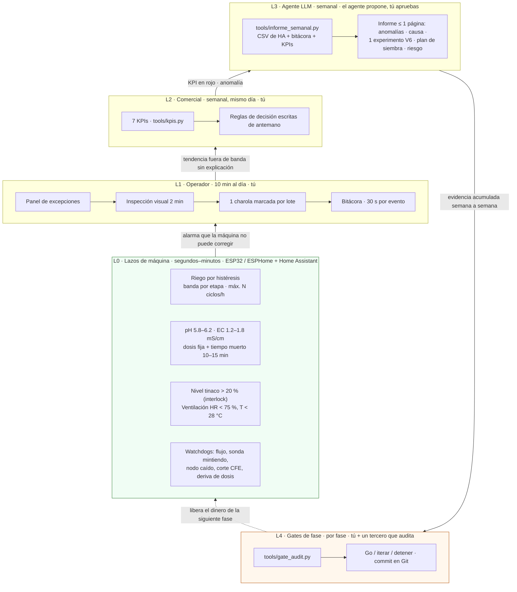
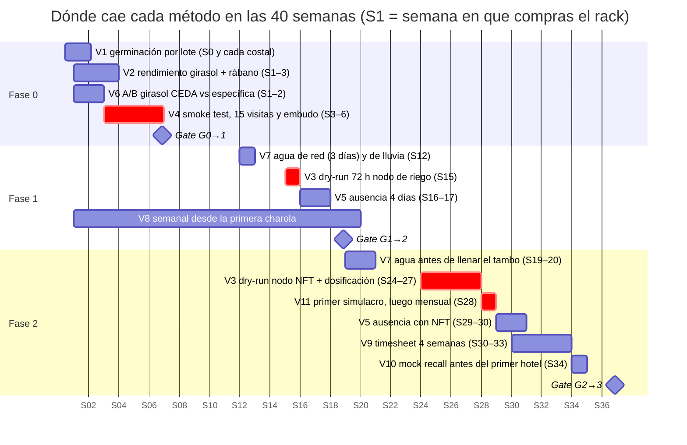

# Validación: lazos L0–L4, métodos V1–V11, KPIs y gates

**En una línea:** el huerto se opera como un sistema de control por capas —cada capa mide, compara contra una referencia escrita de antemano, actúa y registra— y nada avanza "por fe": cada lote, cada compra grande, cada cambio de proceso y cada fase pasan por uno de los once métodos de esta sección antes de gastar un peso más.

!!! info "Antes de empezar"
    - **Tiempo:** 20 min de lectura; después, 10 min al día (L1), 30–60 min el domingo (L2 + L3) y 1–2 h por gate (L4) · **Costo:** $0 (los métodos usan lo que ya está en el BOM; el único gasto recurrente es la calibración de sondas, ~$1,050/año, y el laboratorio de agua, $542–607/muestra) · **Personas:** 1 (+ un tercero que audite los gates)
    - **Necesitas:** `bitacora/produccion.csv` y `bitacora/ventas.csv` llenados el mismo día ([Cómo usar esta guía](../empieza-aqui/como-usar-esta-guia.md)); Python 3.11 para `tools/kpis.py` y `tools/gate_audit.py` ([Herramientas CLI](../software/herramientas-cli.md)); acceso al panel de Home Assistant desde la Fase 1
    - **Prerequisitos:** [06 · Validación y lazos agénticos](../referencia/06-validacion-y-lazos-agenticos.md) es la fuente de todo lo que sigue; [Diseño · Control](../diseno/control.md) explica los lazos L0 y [Diseño · Datos](../diseno/datos.md) el esquema de la bitácora

## Cómo está organizada esta sección

| Página | Qué contiene | Cuándo la abres |
|---|---|---|
| Esta | Arquitectura L0–L4, calendario de validación, tabla de los 11 métodos | Para ubicarte; antes de cada compra grande |
| [V1](v01-germinacion.md) … [V11](v11-apagon.md) | Un método por página: propósito, cuándo, materiales, procedimiento, criterio de aceptación exacto, plantilla CSV, qué hacer si falla | Con las manos en el método |
| [KPIs](kpis.md) | Los 7 KPIs del lazo comercial L2: fórmula, meta, umbral rojo, regla de decisión y cómo los calcula `tools/kpis.py`; revisión semanal de 30 min | Cada domingo |
| [Gates](gates.md) | G0→1, G1→2, G2→3: métrica, umbral, fuente, decisión; auditoría con `tools/gate_audit.py`; formulario de decisión firmada | Al cerrar cada fase |

## Arquitectura de lazos L0–L4

Cinco lazos cerrados, cada uno con su frecuencia y su responsable. La regla de diseño de [06](../referencia/06-validacion-y-lazos-agenticos.md): **una capa solo escala problemas hacia arriba, nunca los resuelve dos veces.** Si L0 puede corregirlo (riego, dosificación), L1 no lo toca; si L1 lo detecta pero no lo explica (rendimiento cayendo), lo empuja a L3.

| Lazo | Qué mide | Referencia | Quién actúa | Frecuencia | Dónde se registra |
|---|---|---|---|---|---|
| **L0** máquina | Humedad de sustrato, pH, EC, nivel, T/HR, flujo, red CFE, voltaje de batería | Bandas y setpoints de [Control](../diseno/control.md) | ESPHome (lazos locales) y Home Assistant (alarmas, escalamiento) | seg–min | `recorder` de HA → export semanal `bitacora/ha/AAAA-Www.csv` |
| **L1** operador | Excepciones, moho, color, estiramiento, germinación en charola | "Lo normal" de cada variedad ([08](../referencia/08-recetas-y-economia-unitaria.md)) | Tú | 10 min diarios | `bitacora/produccion.csv`, `ventas.csv`, `semilla.csv` |
| **L2** comercial | Sell-through, merma, entregas a tiempo, recompra, margen variable, CAC, feedback | Metas y umbrales rojos de [KPIs](kpis.md) | Tú, con reglas escritas | Semanal, 30–60 min, mismo día | `bitacora/informes/AAAA-Www.md` |
| **L3** agéntico | Anomalías de la semana vs las 4 anteriores | Contrato de prompt de [06 §L3](../referencia/06-validacion-y-lazos-agenticos.md) | Agente propone; tú apruebas o corriges; nunca ejecuta compras ni cambia setpoints | Semanal (domingo) | Mismo informe + commit de la decisión |
| **L4** gates | Clientes recurrentes, margen, estabilidad de v1, neto, horas | Umbrales de [Gates](gates.md), escritos en Git antes de la fase | Tú + auditor | Por fase | `bitacora/gates/Gx-y-AAAA-MM-DD.md` |

Escalamiento de alarmas de L0 (canal y tiempo de respuesta, [06](../referencia/06-validacion-y-lazos-agenticos.md)): **Info** → log/dashboard, sin respuesta; **Advertencia** (tinaco < 40 %, HR alta 6 h) → push, mismo día; **Crítica** (flujo cero con bomba ON, nodo caído, nivel < 20 %) → push repetido + Telegram/llamada, respuesta < 1 h.

## Calendario de validación

### Diario (10 min, lazo L1)

1. Panel de excepciones de HA: alarmas de la noche, tendencias fuera de banda. Lo demás no se revisa "por si acaso".
2. Inspección visual de 2 min: pelusa **azul, verde o negra** = charola a la basura; pelos radiculares blancos y uniformes son normales.
3. Muestreo de germinación: contar el cuadro de 10 × 10 cm de **1 charola marcada por lote** ([V1](v01-germinacion.md), [V2](v02-rendimiento.md)).
4. Bitácora: 30 s por evento, el mismo día, nunca de memoria el domingo.

### Semanal (domingo, 30–60 min, siempre el mismo día)

| Bloque | Qué | Método |
|---|---|---|
| Sanitaria (15 min, puede ser el lunes antes de sembrar) | % de charolas con signo de hongo; pulgón en 5 plantas marcadas de albahaca (Fase 2); moscas por trampa | [V8](v08-sanitaria.md) |
| KPIs L2 (10 min) | `python3 tools/kpis.py`; aplicar las reglas de decisión sin discutirlas | [KPIs](kpis.md) |
| Embudo comercial (Fase 0, 5 min) | visitados → probaron → pidieron → recurrentes | [V4](v04-smoke-test.md) |
| Timesheet (5 min, cuando está activo) | Sumar minutos por rubro; comparar con 9 / 12 / 18 h | [V9](v09-timesheet.md) |
| Informe L3 (10 min) | Leer anomalías, causa, el único experimento propuesto, plan y riesgo; aprobar o corregir | [V6](v06-experimento-ab.md) |
| Cierre (5 min) | Plan de siembra del lunes; commit de `bitacora/informes/AAAA-Www.md` | [Datos §5](../diseno/datos.md) |

Máximo **un** experimento V6 activo a la vez.

### Quincenal

- Calibrar sondas pH (buffers 4.01 / 6.86) y EC (patrón 1.413 mS/cm), como evento de `calendar.huerto` con alarma; una sonda sin calibrar es un generador de números aleatorios ([Calibrar sondas](../guias/calibrar-sondas-ph-ec.md), Fase 2).
- Registro de trampas mecánicas perimetrales numeradas (NOM-251, [research/inocuidad §4](../research/inocuidad-operativa.md)).

### Mensual

- [V11 · Simulacro de apagón](v11-apagon.md): breaker del patio abajo 10 min + botón TEST del GFCI (Fase 2; el TEST del GFCI desde la Fase 1).
- Una semana completa de timesheet en régimen ([V9](v09-timesheet.md)).
- Recibo CFE: promedio anual < 220 kWh/mes (alarma de energía en HA, [07 §1](../referencia/07-puntos-ciegos-y-riesgos.md)).

### Por temporada y anual

| Cuándo | Qué | Método |
|---|---|---|
| Al arrancar y cada temporada (inicio de lluvias, fin de lluvias) | EC y pH del agua de red y de la captada | [V7](v07-agua.md) |
| Cada temporada, por especie que vendes | Repetir el ensayo de rendimiento: el invierno y las lluvias mueven el rendimiento y el CV | [V2](v02-rendimiento.md) |
| Una vez al año | Análisis de laboratorio del agua que toca producto (coliformes y metales); recomendado cada 6 meses | [V7](v07-agua.md) |
| Una vez al año, y antes de cada alta como proveedor de hotel | Simulacro de retiro < 2 h | [V10](v10-mock-recall.md) |
| Una vez al año | Electrodo de pH nuevo; prueba de autonomía de la batería | [Calibrar sondas](../guias/calibrar-sondas-ph-ec.md), [V11](v11-apagon.md) |

### Por evento y por fase

Las semanas salen de la [línea de tiempo](../empieza-aqui/linea-de-tiempo.md); las fechas del diagrama son solo para dibujarlo.

## Los 11 métodos

| Método | Qué valida | Cuándo se ejecuta | Criterio de aceptación | Qué desbloquea | Registro |
|---|---|---|---|---|---|
| [V1 · Germinación por lote](v01-germinacion.md) | Que el costal de semilla sirve | Antes de sembrar cualquier lote nuevo; antes de comprar > 1 kg a un proveedor nuevo; **cada costal** | ≥ 85 % germina en 50 semillas (girasol y chícharo ≥ 80 %) | Sembrar el lote; la recompra de 5 kg o bulto de CEDA | `bitacora/semilla.csv` |
| [V2 · Rendimiento por variedad](v02-rendimiento.md) | Que el proceso está controlado y la variedad paga | 3 charolas idénticas por variedad nueva; repetir por temporada | CV < 15 % **y** rendimiento medio cubre el costo con el margen meta | Vender la variedad; fijar precio y mix por $/charola-semana | `produccion.csv` + `bitacora/validacion/v02-rendimiento.csv` |
| [V3 · Dry-run HIL](v03-dry-run.md) | Que las alarmas y los interlocks funcionan antes de arriesgar plantas | 72 h con agua sola al comisionar cada nodo (S15 riego v1; S24–27 NFT v2) y tras cualquier cambio mayor | 100 % de las 6 fallas inyectadas con la alarma correcta en el canal correcto; ningún actuador en estado inseguro | Poner plantas bajo el sistema; arranca el reloj de "v1 estable 30 días" de G1→2 | `bitacora/validacion/v03-dry-run.csv` |
| [V4 · Smoke test comercial](v04-smoke-test.md) | Que alguien paga antes de construir | Fase 0, S3–S6: 15 visitas con muestra | Embudo registrado cada semana; ≥ 2 recurrentes (3 compras semanales cobradas) | G0→1 (a) | `bitacora/embudo.csv` + `ventas.csv` |
| [V5 · Ausencia](v05-ausencia.md) | Que el sistema aguanta 4 días sin ti | Tras V3, con el sistema en producción (Fase 1 y otra vez con NFT en Fase 2) | Cero pérdida de cultivo y cero intervención no prevista | La promesa "aguanta vacaciones"; evidencia de G1→2 (b) | `bitacora/validacion/v05-ausencia.csv` |
| [V6 · Experimento A/B](v06-experimento-ab.md) | Que un cambio de proceso mejora de verdad | Máximo 1 activo; lo propone el agente L3 o tú | Mejora ≥ 10 % la métrica primaria sin empeorar las secundarias; ≥ 3 charolas por brazo | Cambiar el SOP (commit) | `bitacora/validacion/v06-experimentos.csv` |
| [V7 · Agua](v07-agua.md) | Que el agua sirve para riego y NFT y no contamina producto | Al arrancar, cada temporada, antes de llenar el tambo NFT; laboratorio 1×/año | Lluvia EC ≪ 0.3 mS/cm; red clasificada (< 0.4 / 0.4–0.8 / > 0.8); laboratorio sin coliformes ni metales fuera de norma | Ruta del agua del NFT (compras de Fase 2); carpeta de inocuidad | `bitacora/agua.csv` + `bitacora/inocuidad/laboratorio.csv` |
| [V8 · Auditoría sanitaria](v08-sanitaria.md) | Que moho y plagas siguen bajo control | Semanal, desde la primera charola | ≤ 10 % de charolas afectadas y pulgón en < 2 de 5 plantas marcadas | Seguir sembrando la variedad; merma L2 en verde | `bitacora/validacion/v08-sanitaria.csv` |
| [V9 · Timesheet honesto](v09-timesheet.md) | Cuántas horas te cuesta de verdad | 4 semanas seguidas en régimen; luego 1 semana al mes; siempre antes de G2→3 | ≤ 9 h/semana para el gate; > 12 h = hueco en la automatización; ≥ 18 h × 3 semanas = contratar o recortar | G2→3 (b); decisión de ayudante | `bitacora/timesheet.csv` |
| [V10 · Mock recall](v10-mock-recall.md) | Que la trazabilidad funciona | Una vez al año y antes del primer hotel | < 2 h para demostrar costal de origen y clientes destino; cantidades cuadran | Carpeta de inocuidad para hoteles con Distintivo H | `bitacora/inocuidad/mock-recall-AAAA-MM-DD.md` + `bitacora/validacion/v10-mock-recall.csv` |
| [V11 · Simulacro de apagón](v11-apagon.md) | Que el respaldo DC-first sostiene el NFT | Primero al comisionar el bus DC (S28); luego cada mes | Bomba sigue desde batería; llegan las alertas de corte; sin falso "sin flujo" al restaurar | Trasplantar en NFT; checklist de G2→3 (3 registros por trimestre) | `bitacora/electrico.csv` |

!!! tip "Convención de registro de esta sección"
    Los eventos crudos viven donde siempre (`produccion.csv`, `ventas.csv`, `semilla.csv`, `timesheet.csv`, `electrico.csv`, `agua.csv`). El **resultado** de cada método vive en una fila de `bitacora/validacion/vNN-*.csv` (propuesta de esta sección, una fila por corrida), para que `tools/gate_audit.py` y el informe L3 lo lean sin buscar en observaciones. Si no existe el archivo, créalo con el encabezado que trae cada página.

## Antes de cada compra grande: qué método la autoriza

| Vas a… | Antes corre… | Y necesitas… |
|---|---|---|
| Comprar > 1 kg de semilla a un proveedor nuevo (costal de 5 kg, bulto de CEDA) | [V1](v01-germinacion.md) con el kilo de prueba | ≥ 80–85 % |
| Ofrecer una variedad nueva en la hoja de precios | [V2](v02-rendimiento.md) | CV < 15 % y margen |
| Gastar en el túnel (Fase 1, $41,634) | [V4](v04-smoke-test.md) → [G0→1](gates.md) | 2 recurrentes y margen ≥ 55 % |
| Energizar el primer relé en el patio | GFCI + tierra ≤ 25 Ω ([Instalar GFCI y tierra](../guias/instalar-gfci-y-tierra.md)) y luego [V3](v03-dry-run.md) | 100 % de fallas detectadas |
| Comprar NFT, sondas y batería (Fase 2, $35–55k) | [G1→2](gates.md) con [V5](v05-ausencia.md) como evidencia de estabilidad; [V7](v07-agua.md) para decidir la fuente de agua | 3 métricas en verde |
| Trasplantar la primera línea de albahaca | [V3](v03-dry-run.md) del nodo NFT + [V11](v11-apagon.md) | Respaldo probado |
| Cambiar densidad, remojo, oscuridad o un setpoint | [V6](v06-experimento-ab.md) | ≥ 10 % de mejora |
| Escalar volumen o m² | [V9](v09-timesheet.md) y sell-through ≥ 90 % ([KPIs](kpis.md)) | Horas y venta, no optimismo |
| Darte de alta como proveedor de un hotel o cadena | [V10](v10-mock-recall.md) + laboratorio de [V7](v07-agua.md) | Carpeta de inocuidad < 6 meses |
| Pasar a Fase 3 | [V9](v09-timesheet.md) → [G2→3](gates.md) | Neto ≥ $12k × 3 meses y ≤ 9 h |

## Las tres reglas que no cambian

1. **Un gate no alcanzado no se renegocia a la baja; se itera o se detiene.** Las condiciones están en Git antes de empezar la fase; los commits son la prueba de que no se movieron los postes ([06 §L4](../referencia/06-validacion-y-lazos-agenticos.md), [Gates](gates.md)).
2. **Las reglas de decisión de L2 se escriben antes de medir**, para no autoengañarse: sell-through < 75 % dos semanas → no sembrar más volumen; merma > 20 % → congelar variedad y correr V8; cliente ancla sin pedir 2 semanas → visita presencial ([KPIs](kpis.md)).
3. **El agente propone; el humano ejecuta y commitea.** El agente L3 nunca ejecuta compras ni cambia setpoints; el PR es el mecanismo de aprobación ([06 §L3](../referencia/06-validacion-y-lazos-agenticos.md)).

## Al terminar

- [ ] Sabes qué lazo atiende cada problema y a cuál se escala
- [ ] Tienes el domingo bloqueado (mismo día siempre) para L2 + L3
- [ ] Identificaste qué método toca esta semana en el calendario de arriba
- [ ] Creaste `bitacora/validacion/` con los encabezados de los métodos que vas a correr en tu fase
- Registrar: nada todavía; cada método trae su plantilla
- Siguiente paso: [V1 · Germinación](v01-germinacion.md) si estás en Fase 0; [KPIs](kpis.md) si ya vendes; [Gates](gates.md) si vas a cerrar una fase

## Fuentes

- [06 · Validación y lazos agénticos](../referencia/06-validacion-y-lazos-agenticos.md): arquitectura L0–L4, escalamiento, métodos V1–V11, resumen operativo (diario / semanal / quincenal / por fase).
- [07 · Puntos ciegos y riesgos](../referencia/07-puntos-ciegos-y-riesgos.md): tarifa DAC (220 kWh), tiempo real 14.5–17.5 h, regla anti-burnout, neto corregido.
- [08 · Recetas y economía unitaria](../referencia/08-recetas-y-economia-unitaria.md): la métrica $/charola-semana que decide el mix.
- [research/inocuidad-operativa](../research/inocuidad-operativa.md): plan de muestreo de laboratorio, trampas quincenales, mock recall anual.
- [research/electrico-respaldo-seguridad](../research/electrico-respaldo-seguridad.md): prueba mensual del respaldo (§5).
- [Diseño · Control](../diseno/control.md) y [Diseño · Datos](../diseno/datos.md): setpoints, watchdogs, esquema de la bitácora, flujo semanal L2–L4.
- [Línea de tiempo](../empieza-aqui/linea-de-tiempo.md): semanas de cada hito.
