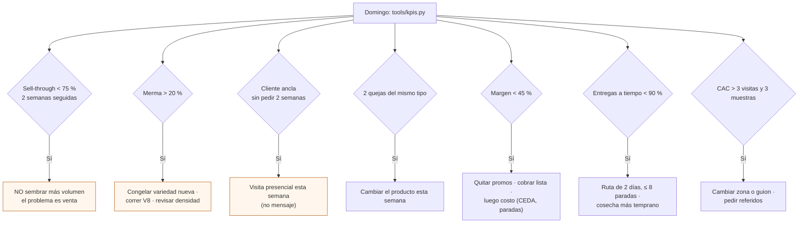

# KPIs del lazo comercial L2

**En una línea:** siete números que calculas cada domingo desde la bitácora —sell-through, merma, entregas a tiempo, recompra, margen variable, CAC y feedback— cada uno con meta, umbral rojo y una regla de decisión escrita de antemano para no autoengañarte; `tools/kpis.py` los saca de `bitacora/*.csv` y la revisión completa cabe en 30 minutos.

!!! info "Antes de empezar"
    - **Cuándo:** **semanal, siempre el mismo día** (domingo), desde la primera venta de la Fase 0 hasta siempre; 30–60 min · **Costo:** $0 · **Personas:** 1
    - **Necesitas:** `bitacora/produccion.csv`, `bitacora/ventas.csv` (llenados el mismo día, nunca de memoria), `bitacora/embudo.csv` (Fase 0), `bitacora/prospectos.csv`, `bitacora/timesheet.csv` (cuando esté activo); Python 3.11 y `tools/kpis.py` ([Herramientas CLI](../software/herramientas-cli.md)); la tabla de costos variables de [08](../referencia/08-recetas-y-economia-unitaria.md)
    - **Prerequisitos:** [Diseño · Datos](../diseno/datos.md) (esquema de la bitácora) · [Cómo usar esta guía](../empieza-aqui/como-usar-esta-guia.md) · [Validación · índice](index.md)

## Los 7 KPIs

Definiciones, metas y umbrales rojos de [06 §L2](../referencia/06-validacion-y-lazos-agenticos.md); la fórmula con columnas es la que implementa `tools/kpis.py` (misma lectura que [Datos §4](../diseno/datos.md)). Entre la meta y el rojo: **ámbar** = vigilar y buscar la causa en el informe L3.

### 1. Sell-through

| | |
|---|---|
| **Definición** | Charolas vendidas ÷ charolas cosechadas, en la semana |
| **Fórmula** | `vendidas` = filas de `produccion.csv` con `fecha_cosecha` en la semana, `destino` = un cliente (no `muestra`, `casa` ni `basura`) y `precio_mxn > 0` · `cosechadas` = filas con `fecha_cosecha` en la semana y `merma_pct < 100` |
| **Meta** | ≥ 90 % |
| **Umbral rojo** | < 75 % **dos semanas seguidas** |
| **Regla de decisión** | **No sembrar más volumen**: el problema es venta, no producción. Más visitas, referidos, canal de hogares |
| **Cómo lo calcula `kpis.py`** | Agrupa `produccion.csv` por semana ISO de `fecha_cosecha`; excluye del numerador `destino` ∈ {`muestra`, `muestras`, `casa`, `basura`}; reporta también las dos semanas anteriores para detectar el "dos seguidas" |

### 2. Merma de producción

| | |
|---|---|
| **Definición** | Charolas tiradas ÷ charolas sembradas |
| **Fórmula** | `tiradas` = filas con `merma_pct = 100` (o `destino = basura`) · `sembradas` = filas con `fecha_siembra` en la cohorte que se cosechó esa semana. Secundario: merma parcial ponderada = Σ `merma_pct` ÷ 100 ÷ n |
| **Meta** | ≤ 10 % |
| **Umbral rojo** | > 20 % |
| **Regla de decisión** | **Congelar la variedad nueva**, correr [V8](v08-sanitaria.md) y revisar densidad de siembra |
| **Cómo lo calcula `kpis.py`** | Por semana y **por variedad** (la merma se esconde en el promedio: girasol y chícharo son nobles; brócoli y betabel fallan más, [07 §6](../referencia/07-puntos-ciegos-y-riesgos.md)); la causa la lee de `observaciones` y lista las charolas tiradas |

### 3. Entregas a tiempo

| | |
|---|---|
| **Definición** | Entregas en la ventana pactada ÷ entregas totales |
| **Fórmula** | filas de `ventas.csv` con `entregado_a_tiempo = si` ÷ filas con `cantidad > 0` y `precio_unit_mxn > 0` |
| **Meta** | 100 % |
| **Umbral rojo** | < 90 % |
| **Regla de decisión** | La ruta o la cosecha de la mañana no aguantan: [Ruta de reparto](../guias/ruta-de-reparto.md) (2 días, ≤ 8 paradas) o adelantar la cosecha |
| **Cómo lo calcula `kpis.py`** | Excluye las filas de "demanda insatisfecha" (`precio_unit_mxn = 0`, `feedback` con `RECHAZADO`), que son la convención del gate [G1→2](gates.md), no entregas |

### 4. Recompra

| | |
|---|---|
| **Definición** | Clientes que repiten pedido semana a semana |
| **Fórmula** | clientes con pedido esta semana **y** la anterior ÷ clientes con pedido la anterior |
| **Meta** | ≥ 80 % |
| **Umbral rojo** | **Cliente ancla sin pedir 2 semanas** |
| **Regla de decisión** | **Visita presencial esa semana**, no mensaje. El cliente es el restaurante, no el chef |
| **Cómo lo calcula `kpis.py`** | Tabla cliente × semana ISO desde `ventas.csv`; lista los clientes sin pedido en las últimas 2 semanas; "ancla" = los 2–3 clientes con más ingreso en las últimas 4 semanas `[POR VERIFICAR: 06 no define "ancla"; propuesta de esta página]` |

### 5. Margen variable

| | |
|---|---|
| **Definición** | (precio − insumos − reparto) ÷ precio, sobre lo que **de verdad** cobraste |
| **Fórmula** | por fila de `ventas.csv`: ingreso = `precio_unit_mxn × cantidad`; insumos = costo variable por variedad de [08](../referencia/08-recetas-y-economia-unitaria.md) (girasol CEDA $9.10 · Al Natural $29.50 · rábano $49.30 · arúgula $35.30 · amaranto $7.50 · brócoli $57.00 · betabel $52.50 · cilantro $20.25; + $3.50 por clamshell); reparto = $15–25 por parada prorrateado entre las charolas de esa parada |
| **Meta** | ≥ 60 % |
| **Umbral rojo** | < 45 % |
| **Regla de decisión** | Primero precio (quitar promos, cobrar lista $90–120 / $130–180); luego costo (girasol CEDA validado con [V1](v01-germinacion.md), fuera variedades caras hasta que Hydrocultura cotice, agrupar paradas). El gate G0→1 (b) exige ≥ 55 % |
| **Cómo lo calcula `kpis.py`** | Mapea `producto` → variedad y formato (`charola girasol`, `clamshell 100 g rabano`) y toma el costo de una tabla dentro del script; el reparto lo estima con `paradas × $20` (o lo lee de `timesheet.csv` `unidades` del rubro `reparto`) `[POR VERIFICAR: nombres de producto admitidos y valor de reparto por defecto en software/herramientas-cli.md]` |

### 6. CAC (costo de adquisición de cliente)

| | |
|---|---|
| **Definición** | Horas de venta + muestras regaladas ÷ clientes cerrados |
| **Fórmula** | horas = `timesheet.csv` rubro `ventas_cobranza` (o `horas_venta_sem` de `embudo.csv` en Fase 0) · muestras = filas de `produccion.csv` con `destino` = `muestra` (o `muestras_regaladas_sem` del embudo) · clientes cerrados = clientes nuevos con primera compra cobrada en el periodo |
| **Meta** | Tender a la baja |
| **Umbral rojo** | > 3 visitas **y** 3 muestras por cliente cerrado |
| **Regla de decisión** | Zona o guion equivocados: cambiar zona, pedir 1 referido a cada chef contento (baja el CAC ~70 %), formalizar con el administrador. Referencia: cerrar un cliente cuesta ~$650 + 8–10 h ([07 §7](../referencia/07-puntos-ciegos-y-riesgos.md)) |
| **Cómo lo calcula `kpis.py`** | Acumulado de las últimas 4 semanas (una semana sola tiene demasiado ruido); visitas desde `prospectos.csv` (`fecha_visita`) |

### 7. Feedback

| | |
|---|---|
| **Definición** | Una pregunta por WhatsApp a cada chef tras la entrega ("¿algo que cambiarías del producto de esta semana?") |
| **Fórmula** | filas de `ventas.csv` con `feedback` no vacío ÷ entregas de la semana |
| **Meta** | Respuesta de ≥ 50 % |
| **Umbral rojo** | **2 quejas del mismo tipo** |
| **Regla de decisión** | **Cambiar el producto esa misma semana** (densidad, corte, empaque, día de entrega) |
| **Cómo lo calcula `kpis.py`** | Cuenta respuestas y **lista los textos** de la semana: la clasificación de "queja" la haces tú. Propuesta: anteponer `QUEJA:` en `feedback` cuando lo sea (`QUEJA: marchito`) para que el script cuente repeticiones `[POR VERIFICAR: convención en software/herramientas-cli.md]` |

## Reglas de decisión, todas juntas

Escritas de antemano ([06 §L2](../referencia/06-validacion-y-lazos-agenticos.md)); el domingo se aplican, no se discuten:



## Cómo los calcula `tools/kpis.py`

Python 3.11, solo biblioteca estándar, lee `bitacora/*.csv` y escribe una tabla Markdown ([Software](../software/index.md), [Datos §4](../diseno/datos.md)). Opciones completas y convenciones de la bitácora: [Herramientas CLI § `kpis.py`](../software/herramientas-cli.md#kpispy).

```bash
# Todo el histórico por semana ISO, con semáforo
python3 tools/kpis.py

# Solo las últimas 4 semanas (lo normal en la revisión del domingo), ya con la
# semilla de CEDA validada por V1 en lugar del costo conservador del 08
python3 tools/kpis.py --semanas 4 --costo girasol=9.10 > bitacora/informes/kpis-2026-W43.md

# Antes de tener bitácora propia: los datos de ejemplo de 6 semanas de Fase 0
python3 tools/kpis.py --produccion bitacora/ejemplo/produccion.csv \
                      --ventas bitacora/ejemplo/ventas.csv
```

Lo que hace, paso a paso:

| Paso | Qué hace | Con qué |
|---|---|---|
| 1 | Valida `siembra_id` con `^[A-Z]{3}-\d{6}-S\d{3}-R\dN\d$`; una fila que no cumple **se reporta, no se descarta** | `produccion.csv` |
| 2 | Agrupa por semana ISO (`fecha_cosecha` en producción; `fecha` en ventas) | ambos |
| 3 | Sell-through y merma por semana y por variedad | `produccion.csv` |
| 4 | Entregas a tiempo, recompra (tabla cliente × semana), feedback (respuestas y textos) | `ventas.csv` |
| 5 | Margen variable con la tabla de costos por variedad y el reparto por parada | `ventas.csv` + tabla del 08 |
| 6 | CAC acumulado 4 semanas | `prospectos.csv`, `timesheet.csv`, `embudo.csv` |
| 7 | Semáforo por KPI (meta / ámbar / rojo) con las 4 semanas anteriores al lado, y la **regla disparada** en texto | — |
| 8 | Tabla Markdown lista para el informe; si un CSV está vacío o roto, lo dice (mismo principio que el contrato del agente L3) | — |

La salida es también el bloque "estado de los KPIs" que `tools/informe_semanal.py` mete en el paquete del agente L3 ([Datos §5](../diseno/datos.md)).

## Revisión semanal de 30 minutos (plantilla)

Mismo día, misma hora, con la bitácora ya llena. Si te toma más de 60 min, la bitácora se llenó de memoria.

| Minuto | Qué haces | Salida |
|---|---|---|
| 0–5 | `python3 tools/kpis.py`; lee la tabla y el semáforo | 7 números con su color |
| 5–10 | Aplica las reglas de decisión de los rojos, sin discutir | Acciones con fecha |
| 10–15 | [V8](v08-sanitaria.md): % de charolas afectadas, trampas, pulgón; merma por variedad | Fila de `v08-sanitaria.csv`; variedad congelada si aplica |
| 15–20 | Cobranza y comercial: facturas vencidas > 7 días (siguiente entrega de contado), embudo (Fase 0), cliente ancla sin pedir, % del cliente y del canal mayor (< 25–30 % y < 60 %) | Lista de llamadas del lunes |
| 20–25 | Informe del agente L3: anomalías, causa probable, **el único** experimento propuesto, plan de siembra, riesgo | Experimento aceptado/rechazado ([V6](v06-experimento-ab.md)) |
| 25–30 | Plan de siembra del lunes (pedidos recurrentes + sell-through + 15–20 % de colchón por merma) y commit | `bitacora/informes/AAAA-Www.md` |

Plantilla de `bitacora/informes/AAAA-Www.md`:

```markdown
# Semana 2026-W43 · revisión L2 + L3

## KPIs (tools/kpis.py)
| KPI | Esta semana | Meta | Rojo | W42 | W41 | W40 | W39 | Estado | Regla disparada |
|---|---|---|---|---|---|---|---|---|---|
| Sell-through | 82 % | ≥ 90 % | < 75 % ×2 | 88 % | 91 % | 79 % | 85 % | ámbar | — |
| Merma | 12 % (arúgula 33 %) | ≤ 10 % | > 20 % | 9 % | 8 % | 15 % | 21 % | ámbar | arúgula: vigilar densidad |
| Entregas a tiempo | 100 % | 100 % | < 90 % | 100 % | 89 % | 100 % | 100 % | verde | — |
| Recompra | 75 % | ≥ 80 % | ancla 2 sem | 100 % | 80 % | 100 % | 67 % | ámbar | RestC sin pedir 1 semana |
| Margen variable | 63 % | ≥ 60 % | < 45 % | 61 % | 58 % | 64 % | 60 % | verde | — |
| CAC (4 sem) | 2.5 visitas · 2 muestras | a la baja | > 3 y 3 | 3.0 · 2.5 | | | | verde | — |
| Feedback | 60 % (3/5) · 0 quejas repetidas | ≥ 50 % | 2 iguales | 40 % | 60 % | 50 % | 25 % | verde | — |

## V8 sanitaria
% afectadas: 6.7 % · pulgón: 0/5 · trampas: T1 4, T2 2 · umbral: no

## Cobranza y cartera
Vencidas > 7 días: ninguna · cliente mayor: RestA 28 % · canal mayor: restaurantes 82 % (> 60 %: abrir hogares)

## Informe L3 (resumen y decisión)
- Anomalía: rendimiento de arúgula −18 % vs 4 semanas; causa probable: HR nocturna 78 % 3 noches
- Experimento propuesto: arúgula 11 g vs 10 g con forzado nocturno → ACEPTADO como EXP-20261026-arugula-densidad
- Plan de siembra propuesto: 8 girasol + 6 rábano + 3 arúgula → aprobado con 1 rábano más (pedido de RestB)
- Riesgo: Semana Santa −20 % → no lanzar variedad nueva

## Decisiones y acciones (con fecha)
- [ ] Lunes: visita presencial a RestC (regla de recompra) — 2026-10-27
- [ ] Arúgula a 11 g solo en el brazo del experimento; el SOP sigue en 10 g hasta el resultado
- [ ] Abrir lista de espera de hogares (canal > 60 %)
```

Commit: `git commit -m "informe 2026-W43: sell-through 82 %, merma 12 %, EXP arugula aceptado"`.

!!! warning "Errores típicos"
    - Calcular el margen con precios de lista cuando vendiste con promo, o sin el reparto.
    - Contar como "vendida" la charola que se fue de muestra o a casa.
    - Mirar el promedio de merma y no la merma por variedad.
    - Discutir la regla el domingo ("es que esta semana fue rara"): por eso se escribió el lunes anterior.
    - Saltarse la revisión la semana "aburrida": sin las 4 semanas anteriores el agente no puede decir qué es anómalo.

## Al terminar

- [ ] `tools/kpis.py` corrido con la bitácora del mismo día; 7 KPIs con semáforo
- [ ] Reglas de los rojos aplicadas con acción y fecha
- [ ] V8 registrado; cobranza revisada
- [ ] Informe L3 leído; un experimento decidido; plan de siembra aprobado
- [ ] `bitacora/informes/AAAA-Www.md` commiteado
- Registrar: el informe semanal (plantilla arriba); las acciones como issues si usas GitHub
- Siguiente paso: [V6](v06-experimento-ab.md) si aceptaste un experimento; [Gates](gates.md) si esta semana cierra una fase

## Fuentes

- [06 · Validación §L2 y §L3](../referencia/06-validacion-y-lazos-agenticos.md): los 7 KPIs con definición, meta y umbral rojo; las tres reglas de decisión; el contrato del informe L3.
- [Diseño · Datos §4 y §5](../diseno/datos.md): fórmulas con columnas, `tools/kpis.py` con biblioteca estándar, validación de `siembra_id`, flujo del domingo.
- [08 · Recetas y economía unitaria](../referencia/08-recetas-y-economia-unitaria.md): costos variables por charola y precios de lista.
- [07 · Puntos ciegos §5, §6, §7, §8](../referencia/07-puntos-ciegos-y-riesgos.md): ningún canal > 60 % ni cliente > 25–30 %, merma realista, CAC ~$650 + 8–10 h, referidos, cobranza 7/14/45.
- [Fase 0 · Gate §KPIs de apoyo](../fases/fase-0/gate.md) y [Fase 1 · Gate](../fases/fase-1/gate.md): reparto $15–25 por parada, convención de "RECHAZADO sin capacidad".
- [Software](../software/index.md): quién manda en cada capa; `kpis.py` sobre `bitacora/*.csv`.
