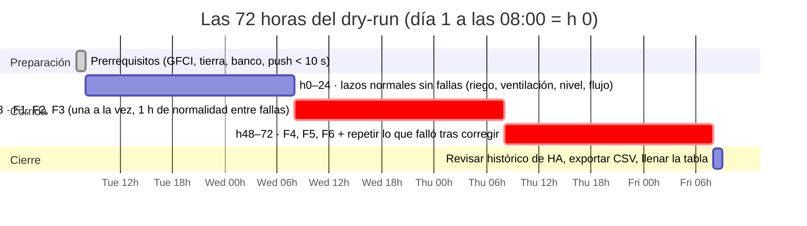

# V3 · Dry-run de automatización (HIL casero)

**En una línea:** antes de poner una sola planta bajo el sistema, lo corres 72 h con agua sola y le inyectas seis fallas a propósito —bomba desconectada, tinaco vacío, línea pellizcada, ESP32 apagado, Wi-Fi cortado, breaker abajo— y solo lo aceptas si el 100 % produjo la alarma correcta en el canal correcto y ningún actuador quedó en estado inseguro; la tabla FMEA-lite que llenas es la evidencia.

!!! info "Antes de empezar"
    - **Cuándo:** al comisionar cada nodo nuevo (S15: nodo de riego v1 en Fase 1; S24–27: nodo NFT v2 y dosificación en Fase 2) y después de cualquier cambio mayor de firmware, cableado o setpoints · **Tiempo:** 72 h de corrida + ~3 h de inyección de fallas repartidas + 30 min de registro · **Costo:** $0 (agua, luz de 3 días) · **Personas:** 1
    - **Necesitas:** nodo flasheado y en su gabinete IP65; GFCI y tierra ≤ 25 Ω **ya instalados** ([Instalar GFCI y tierra](../guias/instalar-gfci-y-tierra.md)); Home Assistant con notificaciones probadas (< 10 s al celular); charolas con sustrato **sin semilla** (Fase 1) o tambo con agua **sin nutriente** (Fase 2); cronómetro; esta tabla impresa; `bitacora/validacion/v03-dry-run.csv`
    - **Guías relacionadas:** [Automatización v1 §6](../fases/fase-1/automatizacion-v1.md) · [Dosificación v2 §D](../fases/fase-2/dosificacion-v2.md) · [Configurar Home Assistant](../guias/configurar-home-assistant.md) · [Diseño · Control](../diseno/control.md) · **Desbloquea:** poner plantas bajo el sistema; arranca el reloj de "v1 estable 30 días" de [G1→2](gates.md)

## Propósito

Un lazo que actúa sin verificar que la acción ocurrió no es un lazo, es una esperanza ([06 · Watchdogs](../referencia/06-validacion-y-lazos-agenticos.md)). Las alarmas que nunca se probaron fallan el día que importan, y en NFT ese día cuesta 6–8 líneas de albahaca en 2–4 h ([research/electrico-respaldo §1](../research/electrico-respaldo-seguridad.md)). El dry-run es un HIL (*hardware-in-the-loop*) casero: hardware real, agua real, fallas reales, cero plantas en riesgo.

## Las seis fallas y lo que debe pasar (FMEA-lite)

Canales de [06 §Escalamiento](../referencia/06-validacion-y-lazos-agenticos.md): **Advertencia** = push en la app de HA, respuesta el mismo día; **Crítica** = push repetido + Telegram o llamada, respuesta < 1 h. "Estado seguro" es lo que el actuador debe hacer **aunque nadie conteste**.

=== "Fase 1 · nodo de riego v1 (sustrato)"

    Estado seguro de la bomba de riego en sustrato: **apagada** (`restore_mode: ALWAYS_OFF`, tope físico de 120 s por ciclo, máximo N ciclos/h en el nodo). Setpoints iniciales en [Control](../diseno/control.md).

    | # | Falla inyectada | Cómo la provocas | Efecto esperado | Detección esperada | Respuesta esperada (actuador + canal) | Estado seguro que verificas |
    |---|---|---|---|---|---|---|
    | F1 | **Desconectar la bomba** | Con el lazo pidiendo riego, quita el conector de P-1 (o el fusible F1 de 5 A) | K1 cierra, no sale agua; la humedad de sustrato no sube | Humedad sin subir tras **2 ciclos** de riego | **Advertencia** "riego sin efecto" (push, mismo día) | K1 no queda cerrado más de 120 s por ciclo; no más de N ciclos/h; no hay "riego infinito" |
    | F2 | **Vaciar el tinaco < 20 %** | Abre V-1 a chorro a la coladera hasta que LT-1 marque < 20 % (antes pasa por < 40 %) | Nivel bajo real | JSN-SR04T < 40 % → advertencia; **< 20 %** → interlock | Advertencia "tinaco bajo" (push); **crítica** "tinaco crítico" (push repetido); `switch.bomba_riego` **bloqueada** | La bomba no arranca aunque el sustrato esté seco; rearma sola al **25 %** al rellenar |
    | F3 | **Pellizcar la línea** | Cierra la válvula del manifold de un nivel (p. ej. N2) o dobla su manguera; deja los demás abiertos | Ese nivel no sube humedad; los otros sí | Sensor de ese nivel sin cambio tras 2 ciclos | Advertencia "riego sin efecto N2" (push) | El lazo no "compensa" regando sin fin: tope de ciclos/h respetado |
    | F4 | **Apagar un ESP32** | Quita el fusible F0 del nodo (o desconecta el buck) | Entidades `unavailable`; heartbeat OFF | `binary_sensor.nodo_riego_estado` OFF **≤ 10 min** | **Crítica** "nodo de riego caído" (push repetido + Telegram/llamada); el riego automático de HA no dispara sin nodo | Relés sin energía = todo OFF; al reconectar, arranca con bomba apagada y sin alarmas falsas |
    | F5 | **Cortar el Wi-Fi 30 min** | Apaga el router o el punto de acceso del patio 30 min; el nodo sigue con energía | HA pierde telemetría; el nodo sigue solo | Nodo caído en HA a los 10 min | Crítica "nodo caído" (push); **el lazo local sigue** con su tope de 120 s y N ciclos/h | Sin riego infinito durante el corte; al volver el Wi-Fi las entidades reconectan **sin rearme manual** |
    | F6 | **Botar el breaker del patio 10 min** (+ botón TEST del GFCI) | Oprime TEST en el QO120GFI (la palanca salta = prueba del GFCI); déjalo abajo 10 min; rearma OFF → ON | 127 V fuera: fuente ELI-1260 y nodo apagados; cerebro y router siguen por UPS | Nodo caído (crítica) y, al volver, aviso de **corte con duración** (por NUT del UPS o al reconectar el nodo) | Push; el GFCI **no** vuelve a disparar al re-energizar | El nodo arranca solo con la bomba **APAGADA**; luces T8 vuelven según horario; sin alarmas falsas |

    Filas extra recomendadas (no cuentan para el 100 %, pero se corren una vez): **F7** desconectar un capacitivo → lectura fija o fuera de rango → sensor "no confiable" → ese nivel no dispara riego; **F8** reiniciar Home Assistant → nada cambia en el patio; al volver, sin alarmas falsas.

=== "Fase 2 · nodo NFT v2 (recirculación y dosificación)"

    Estado seguro de la bomba NFT: **encendida** (K1 por contacto **NC** + `restore_mode: RESTORE_DEFAULT_ON`; batería siempre en paralelo). Umbrales: flujo < **2 L/min** por **60 s** con **20 s de gracia** tras arranque; nodo caído 5–10 min; corte de CFE a los 30 s; batería baja < 12.9 V por 5 min ([Control · Lazo 4](../diseno/control.md), [research/electrico-respaldo §5](../research/electrico-respaldo-seguridad.md)).

    | # | Falla inyectada | Cómo la provocas | Efecto esperado | Detección esperada | Respuesta esperada (actuador + canal) | Estado seguro que verificas |
    |---|---|---|---|---|---|---|
    | F1 | **Desconectar la bomba** P-1 | Quita el fusible F1 o el conector de P-1 con K1 comandando ON | Flujo cae a 0 con bomba "ON" | YF-S201 < 2 L/min durante **60 s** | K2 arranca **P-2 (respaldo)**, P-1 se apaga (protección en seco); **crítica** "NFT SIN FLUJO" en ≤ 90 s (push crítico repetido + Telegram/llamada) | Agua circulando por P-2; la alarma **no se apaga sola**: rearme manual con `button.rearmar_alarma_de_flujo` tras revisar |
    | F2 | **Vaciar el tinaco < 20 %** (TK-1, agua cruda) | Abre V-1 a la coladera hasta LT-1 < 20 % | Nivel bajo de agua cruda | LT-1 < 20 % | Interlock: **solenoide de llenado SV-1 bloqueada**, bomba de riego de microgreens bloqueada, dosificación suspendida; crítica (push repetido) | La recirculación del **tambo** (TK-2) sigue: el NFT no depende del tinaco; el tambo tiene su propio interlock de nivel `[POR VERIFICAR: el flotador LT-2 no está en bom/fase2; sin él ese interlock queda desactivado — Control §Setpoints]` |
    | F3 | **Pellizcar la línea** | Cierra la válvula de compuerta del manifold (o pellizca la descarga) 60 s con P-1 ON | Flujo < 2 L/min | YF-S201 < 2 L/min 60 s | Igual que F1: P-2 ON, P-1 OFF, crítica | Al abrir y rearmar: P-1 ON, P-2 OFF, flujo de vuelta a 8–16 L/min. Cerrar **una sola** línea no dispara nada (el flujo total sigue > 2 L/min): es por diseño; anótalo |
    | F4 | **Apagar el ESP32** del NFT | Quita su fusible de 2 A | Sin cerebro local | `binary_sensor.nodo_nft_estado` OFF 5–10 min | **Crítica** "nodo NFT sin señal" (push); no hay dosificación mientras tanto | **P-1 sigue corriendo** (K1 NC sin bobina = cerrado): el fail-safe es físico. Al reconectar, `RESTORE_DEFAULT_ON` deja la bomba encendida y no llega falso "sin flujo" (20 s de gracia) |
    | F5 | **Cortar el Wi-Fi 30 min** | Apaga el router 30 min | HA sin telemetría; el nodo sigue con energía | Nodo caído en HA a los 5–10 min | Crítica "nodo sin señal" (push). **Durante el corte** repite F3: el respaldo por flujo debe actuar **sin HA** (`switch.respaldo_automatico_por_flujo` es local) | Continuidad del agua sin depender de HA; dosificación local respeta el tiempo muerto; al volver, sin rearme |
    | F6 | **Botar el breaker del patio 10 min** (+ TEST del GFCI) = [V11](v11-apagon.md) | TEST → palanca abajo 10 min → rearme | Cargador deja de flotar; la batería sostiene el bus **sin conmutación** | `red_cfe_presente` OFF a los 5 s; aviso a los 30 s | Push "corte de luz" con V_bat y autonomía; **P-1 ni parpadea**; al restaurar, aviso con duración ≈ 10 min y **sin** falso "sin flujo" | V_bat > 12.9 V tras 10 min (0.55 Ah de 90); nodo de riego v1 (127 V) cae y **regresa solo**; GFCI no dispara al rearmar |

    Filas extra recomendadas: **F7** sonda de pH fuera del agua → lectura fija o salto > 1.5 → "sonda no confiable", dosificación suspendida, alarma, rearme manual solo tras calibrar ([Calibrar sondas](../guias/calibrar-sondas-ph-ec.md)); **F8** reiniciar Home Assistant → nada cambia en el agua; sin alarmas falsas al volver; **F9** (dry-run de dosificación, [Dosificación v2 §D](../fases/fase-2/dosificacion-v2.md)) → pH baja y EC sube por dosis con tiempo muerto, sin oscilación, y cada interlock bloquea la dosis.

## Procedimiento (72 h)



1. **h −1 · Prerrequisitos.** Tierra ≤ 25 Ω por escrito y TEST del GFCI dispara; tabla de banco (lectura vs referencia por sensor) hecha; notificación de prueba llega al celular en < 10 s, con el teléfono en silencio para la crítica. *Criterio de listo:* los tres puntos marcados en el issue.
2. **h 0 · Arranque con agua sola.** Fase 1: 4 charolas con sustrato húmedo sin semilla, una por nivel regado, sensor con el conector hacia arriba. Fase 2: tambo lleno de agua sin nutriente, 8 líneas abiertas, sondas en el retorno. *Criterio de listo:* todas las entidades reportan en HA y el dashboard muestra valores plausibles.
3. **h 0–24 · Sin fallas.** Observa los lazos normales: ciclos de riego por hora y su duración (Fase 1), caudal por línea 1–2 L/min y total 8–16 L/min (Fase 2), ventilación por HR. Ajusta bandas y `t_max` si hace falta **ahora**, no durante las fallas. *Criterio de listo:* 24 h sin alarma falsa y sin actuador encendido fuera de regla.
4. **h 24–48 · F1, F2, F3.** Una falla a la vez: anota la hora exacta de inyección, cronometra hasta que llega la notificación, apunta canal y texto, verifica el estado del actuador en sitio, restaura y espera ≥ 1 h de normalidad antes de la siguiente. *Criterio de listo:* tres filas completas con `t_deteccion_s` y `actuador_seguro`.
5. **h 48–72 · F4, F5, F6.** Igual. F5 (Wi-Fi) es la única en la que además provocas una segunda falla **durante** la primera (Fase 2: pellizca la línea sin HA). F6 incluye el botón TEST del GFCI. *Criterio de listo:* seis filas; las que fallaron se corrigieron y **se repitieron**.
6. **h 72 · Cierre.** Exporta de HA el histórico de los 3 días (el mismo paquete que arma `tools/informe_semanal.py`) y revisa: ninguna bomba encendida más del tope, ningún solenoide abierto con tinaco bajo, ninguna dosis fuera del tiempo muerto. *Criterio de listo:* CSV adjunto al issue; tabla en `bitacora/validacion/v03-dry-run.csv`.
7. **Después (Fase 1):** 7 días con 4 charolas testigo **con semilla** sin intervención; es el criterio de commissioning de [03](../referencia/03-instalacion.md). **Después (Fase 2):** purga, solución nueva, plantas, y el primer [V11](v11-apagon.md) formal.

## Criterio de aceptación

!!! example "Aceptar el sistema si"
    - Las **6 fallas** (F1–F6) produjeron **la alarma correcta en el canal correcto** (advertencia → push; crítica → push repetido + Telegram/llamada) dentro del tiempo esperado de su fila.
    - **Ningún actuador quedó en estado inseguro**: bomba de sustrato encendida sin tope, bomba NFT parada, solenoide de llenado abierta con tinaco bajo, dosificación con sonda no confiable, respaldo que no arranca.
    - Tras cada restauración el sistema volvió a normal **sin rearme manual**, salvo el rearme de flujo del NFT, que es manual por diseño.
    - La tabla está llena con hora de inyección, `t_deteccion_s`, canal y texto de cada notificación.

    Una falla no detectada no se "pasa con observaciones": se corrige y se repite esa fila. **100 % o no hay plantas** ([06 §V3](../referencia/06-validacion-y-lazos-agenticos.md)).

## Plantilla de registro

`bitacora/validacion/v03-dry-run.csv`, una fila por falla y por corrida:

```csv
fecha,fase,nodo,falla_id,falla,hora_inyeccion,efecto_observado,deteccion_observada,t_deteccion_s,canal,respuesta_observada,actuador_seguro,ok,observaciones
2027-01-19,1,nodo-riego-v1,F1,desconectar bomba,10:05,humedad N1-N4 sin subir tras 2 ciclos,advertencia riego sin efecto,1460,push,K1 abrio a los 120 s cada ciclo; 3 ciclos y paro,si,si,texto: "Riego sin efecto: humedad no subio en 2 ciclos"
2027-01-19,1,nodo-riego-v1,F2,tinaco < 20 %,14:30,LT-1 38 % -> 18 %,advertencia 40 % + critica 20 %,25,push repetido + telegram,bomba bloqueada; rearme al 25 % al rellenar,si,si,
2027-01-20,1,nodo-riego-v1,F4,apagar ESP32,09:00,entidades unavailable,nodo caido,612,push repetido + telegram,riego de HA no disparo; al reconectar bomba OFF,si,si,10 min 12 s
2027-01-20,1,nodo-riego-v1,F5,wifi 30 min,11:00,HA sin datos,nodo caido,600,push,lazo local siguio: 2 ciclos de 120 s en 30 min,si,no,al volver el wifi HA marco "riego sin efecto" falso: subir el for: a 15 min y REPETIR
2027-01-21,1,nodo-riego-v1,F5,wifi 30 min (repeticion),09:00,HA sin datos,nodo caido,598,push,sin alarma falsa al volver,si,si,corregido en automations.yaml commit abc123
```

- `ok` = `si` solo si detección, canal, tiempo y estado seguro coincidieron con la tabla; una fila `no` obliga a una fila de repetición con `ok=si` antes de aceptar.
- Guarda las capturas de las notificaciones con el nombre `v03-AAAA-MM-DD-Fn.png` junto al CSV exportado de HA.

## Si falla

| Fila | Síntoma | Causa probable | Qué hacer |
|---|---|---|---|
| F1 (F1 sustrato) | Nunca llega "riego sin efecto" | La automatización compara contra el ciclo equivocado o `for:` muy largo; sensor con histéresis | Revisar la condición en `automations.yaml`; bajar `for:`; repetir |
| F1 / F3 (NFT) | P-2 no arranca | `switch.respaldo_automatico_por_flujo` OFF; fusible F2; K2; el flujo no bajó de 2 L/min (válvula no cerró del todo); segundos de alarma mal puestos | [Armar el respaldo DC §D](../guias/armar-respaldo-dc.md); repetir |
| F2 | La bomba arranca con tinaco < 20 % | Interlock solo en HA y no en el nodo, o entidad de nivel mal nombrada | El interlock va **en el firmware** (`Tinaco nivel minimo interlock`); HA solo avisa ([Firmware](../software/firmware.md)) |
| F4 / F5 | La crítica llega tarde o no llega | `for:` distinto de 10 min; teléfono en "no molestar" sin canal crítico; router sin UPS | Push con `interruption-level: critical` (iOS) o canal de importancia alta (Android); UPS al router ([Configurar HA](../guias/configurar-home-assistant.md)) |
| F4 (NFT) | La bomba se detiene al apagar el ESP32 | K1 cableado en NO en lugar de NC, o bomba colgada de la salida del nodo y no del bus | Recablear a NC; la bomba cuelga del bus de batería ([Fase 2 · Eléctrico y respaldo §B](../fases/fase-2/electrico-respaldo.md)) |
| F5 | "Riego infinito" durante el corte de Wi-Fi | El tope de ciclo vive solo en HA | `on_turn_on: delay + turn_off` en el YAML del nodo; N ciclos/h como `number` del nodo |
| F6 | El GFCI no dispara con TEST, o dispara al rearmar | Breaker mal cableado; fuga real en una carga | No sigas: electricista; desconecta cargas una por una ([Instalar GFCI y tierra](../guias/instalar-gfci-y-tierra.md)) |
| F6 (NFT) | Llega "NFT SIN FLUJO" al restaurar | Gracia tras arranque corta; aire en el YF-S201 | Subir `Flujo gracia tras arranque` a 30–40 s; purgar aire; válvula check |
| Cualquiera | Alarma falsa en las 24 h sin fallas | Banda o `for:` mal puestos; sensor ruidoso | Ajustar en h 0–24; una alarma falsa por semana en producción entrena a ignorar la real |

!!! warning "Errores típicos"
    - Inyectar dos fallas a la vez y no saber cuál disparó qué.
    - Probar con el teléfono en la mano y sonido alto: la crítica debe llegar con el teléfono **en silencio** en la mesa de noche.
    - Aceptar "5 de 6" porque la sexta "casi": el criterio es 100 %.
    - Correr el dry-run con plantas "para no perder tiempo".
    - No repetir el V3 tras cambiar un setpoint o un pin: cada cambio mayor vuelve a poner el sistema en "no probado".

## Al terminar

- [ ] 24 h sin fallas sin alarma falsa; bandas y topes ajustados y anotados
- [ ] 6 filas con `ok=si` (las repetidas incluidas) en `bitacora/validacion/v03-dry-run.csv`
- [ ] Capturas de las notificaciones y export CSV de HA de los 3 días en el issue
- [ ] Ningún actuador en estado inseguro en el histórico
- [ ] Fase 1: 7 días con 4 charolas testigo sin intervención · Fase 2: purga y solución nueva
- Registrar: en `bitacora/produccion.csv`, `observaciones` = "riego automático desde AAAA-MM-DD" en el primer lote (Fase 1); `bitacora/nft.csv` `evento=dry_run_dosificacion` (Fase 2)
- Siguiente paso: [V5 · Ausencia](v05-ausencia.md) cuando haya plantas; el reloj de 30 días de [G1→2](gates.md) arranca hoy

## Fuentes

- [06 · Validación §L0 (lazos, watchdogs, escalamiento) y §V3](../referencia/06-validacion-y-lazos-agenticos.md): 72 h, las fallas a inyectar, criterio 100 %, tabla FMEA-lite.
- [research/electrico-respaldo-seguridad §5](../research/electrico-respaldo-seguridad.md): YAML de flujo, red CFE, respaldo, modo ahorro y nodo caído; §1 el costo de una tarde sin flujo.
- [Diseño · Control](../diseno/control.md): setpoints, estados seguros (K1 NC, `RESTORE_DEFAULT_ON`, `ALWAYS_OFF`), tabla FMEA-lite ampliada, gracia de 20 s.
- [Fase 1 · Automatización v1 §6](../fases/fase-1/automatizacion-v1.md) y [Fase 2 · Dosificación v2 §D](../fases/fase-2/dosificacion-v2.md): las tablas de fallas por fase y el dry-run de dosificación.
- [Guía · Simulacro de apagón](../guias/simulacro-de-apagon.md): tiempos exactos de F6 y su diagnóstico.
- [03 · Instalación](../referencia/03-instalacion.md): commissioning de Fase 1 (7 días con charolas testigo) y de Fase 2.
