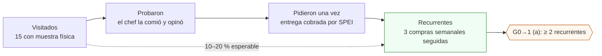

# V4 · Smoke test comercial (vender antes de construir)

**En una línea:** la Fase 0 completa, formalizada como método: 15 restaurantes mapeados, visitas con muestra física, y cada semana las cuatro cifras del embudo —visitados → probaron → pidieron una vez → recurrentes— para saber, antes de gastar $31–42k en el túnel, si alguien paga por SPEI tres semanas seguidas.

!!! info "Antes de empezar"
    - **Cuándo:** Fase 0, semanas 3–6 (las visitas empiezan cuando hay producto cortado esa mañana); se registra **cada semana** · **Tiempo:** 2 mañanas por semana de visitas + 2 entregas; cerrar un cliente cuesta ~8–10 h y ~$650 de bolsillo ([07 §7](../referencia/07-puntos-ciegos-y-riesgos.md)) · **Costo:** muestras (1 charola de girasol = 3–5 muestras de 100 g ≈ $9 de insumo; clamshell $3.50) + transporte · **Personas:** 1
    - **Necesitas:** producto de la semana 2 en adelante, clamshells y etiquetas con lote, hielera con gel packs, hoja de precios de una página, WhatsApp Business, CLABE de negocio, talonario de remisiones; `bitacora/prospectos.csv`, `bitacora/embudo.csv`, `bitacora/ventas.csv`
    - **Guías relacionadas:** [Fase 0 · Vender a chefs](../fases/fase-0/ventas.md) (el paso a paso completo) · [Visitar a un chef](../guias/visitar-a-un-chef.md) · [Hoja de precios](../guias/hoja-de-precios.md) · [Cobrar y suspender](../guias/cobrar-y-suspender.md) · **Desbloquea:** [G0→1 (a)](gates.md)

## Propósito

El riesgo número uno del proyecto es **no vender**, y la Fase 0 existe para acotarlo a ~$6k ([00 · Riesgos](../referencia/00-plan-maestro.md)). El smoke test convierte "creo que los chefs van a querer" en cuatro números semanales. La conversión visitado → recurrente esperable es **10–20 %**: de 15 visitas reales salen 2–3 clientes. Si tras 15 visitas hay **0 recurrentes**, el problema es producto, precio o zona, y se pivota **antes** de la Fase 1 ([06 §V4](../referencia/06-validacion-y-lazos-agenticos.md)).



## Definiciones (para que las cuatro cifras no se inflen)

| Cifra | Cuenta si… | No cuenta |
|---|---|---|
| **Visitados** | Entraste con muestra física y hoja de precios y hablaste con el chef, sous chef o administrador (o dejaste muestra + hoja + WhatsApp y confirmaron que la recibió) | Mensajes de WhatsApp sin visita; visitas sin muestra |
| **Probaron** | El chef comió la muestra y dio una opinión (aunque sea "no") | Muestra dejada sin respuesta |
| **Pidieron una vez** | Una entrega con remisión firmada **y SPEI recibido** ese día | Muestra gratis, pedido "para la otra semana", entrega no cobrada |
| **Recurrentes** | **3 semanas ISO consecutivas** con compra cobrada; una semana sin pedido reinicia la racha | El que "seguro pide la próxima" |

El cliente es el **restaurante**, no el chef ([07 §7](../referencia/07-puntos-ciegos-y-riesgos.md)); acumula el acumulado de visitados desde la S3.

## Procedimiento

1. **Mapea 15 restaurantes** en radio de 5 km (cocina de autor, brunch, pokés, coctelería, dark kitchens; excluye < 6 meses operando) y guárdalos en `bitacora/prospectos.csv`. Ningún cliente futuro debe pesar > 25–30 % de tus ventas: la meta son 4–5 medianos, no 1 grande. *Criterio de listo:* 15 filas con zona, tipo, contacto y mejor horario.
2. **Prepara la muestra la mañana de la visita**: clamshell ~100 g (girasol + una fina), etiqueta con `siembra_id`, hielera con gel packs (< 10 °C 4–6 h), una charola viva de exhibición. *Criterio de listo:* muestra cortada hoy, etiquetada, fría.
3. **Visita sin cita, martes a jueves de 10 a 12 h**, con el guion de 90 s de [Vender a chefs §4](../fases/fase-0/ventas.md): quién eres, abre la muestra y cállate, oferta gancho (entrega semanal fija, charola viva, sin mínimo el primer mes, sin crédito), una pregunta ("¿qué usan hoy y cuánto les cuesta?"), cierre con fecha y WhatsApp **del administrador**. *Criterio de listo:* fila de `prospectos.csv` actualizada el mismo día.
4. **A las 48–72 h** manda la foto de la charola del día y una sola pregunta: "¿algo que cambiarías del producto?" *Criterio de listo:* respuesta o silencio anotado (alimenta el KPI de feedback).
5. **Entrega y cobra**: remisión firmada en cada entrega; **SPEI contra entrega, cero excepciones** en Fase 0 (estás validando que *pagan*, no que *quieren*). Cada entrega es una fila en `bitacora/ventas.csv`. *Criterio de listo:* comprobante del SPEI en el teléfono el mismo día.
6. **Domingo: registra el embudo** en `bitacora/embudo.csv` con las cuatro cifras acumuladas de la semana, más muestras regaladas y horas de venta (insumo del CAC). *Criterio de listo:* una fila por semana, S3 a S6, sin huecos.
7. **Aplica las reglas de lectura** escritas de antemano ([06 §L2](../referencia/06-validacion-y-lazos-agenticos.md)): cliente sin pedir 2 semanas → visita presencial; 2 quejas del mismo tipo → cambia el producto esa semana; sell-through < 75 % dos semanas → no siembres más volumen. *Criterio de listo:* cada regla disparada tiene una acción con fecha.
8. **Fin de S6:** cuenta los recurrentes y pasa al [gate G0→1](../fases/fase-0/gate.md). *Criterio de listo:* `recurrentes` de la última fila coincide con la tabla cliente × semana de `ventas.csv`.

## Criterio de aceptación

!!! example "Aceptar el smoke test si"
    - `bitacora/embudo.csv` tiene **las cuatro cifras de cada semana** (S3–S6), sin reconstruir de memoria.
    - Se hicieron **≥ 15 visitas reales** con muestra física (≥ 12 con el chef o sous chef presente).
    - Hay **≥ 2 recurrentes** (3 compras semanales consecutivas, cobradas por SPEI) al cierre de la S6 — es la métrica (a) de [G0→1](gates.md).
    - La conversión visitado → recurrente cae en el rango esperable de **10–20 %** o lo supera.

    Con 15 visitas y **0 recurrentes** el método reprueba: se pivota producto, precio o zona antes de invertir en Fase 1; con 1 recurrente se itera una sola vez, 2 semanas.

## Plantilla de registro

`bitacora/embudo.csv` (una fila por semana, el domingo):

```csv
semana,visitados_acum,probaron_acum,pidieron_una_vez_acum,recurrentes,conversion_pct,muestras_regaladas_sem,horas_venta_sem,observaciones
2026-W41,8,6,1,0,0,7,6.5,"ronda 1 Roma-Condesa; 2 chefs ausentes: volver jueves"
2026-W42,15,12,4,0,0,9,7.0,"ronda 2 Coyoacan; primer pedido cobrado martes (RestA)"
2026-W43,15,12,5,1,7,3,3.5,"RestA 3a semana seguida; RestB pidio 2 veces"
2026-W44,15,13,5,2,13,2,3.0,"RestB completa 3 semanas; RestC sin pedir 2 semanas -> visita presencial"
```

- `conversion_pct` = `recurrentes ÷ visitados_acum × 100`.
- `muestras_regaladas_sem` y `horas_venta_sem` alimentan el CAC de [KPIs](kpis.md) (umbral rojo: > 3 visitas y 3 muestras por cliente cerrado).
- `bitacora/prospectos.csv` (una fila por restaurante): `restaurante,zona,tipo,chef,administrador,whatsapp,mejor_horario,fecha_visita,probo,pidio,semanas_seguidas,notas`.
- `bitacora/ventas.csv` (una fila por entrega): `fecha,cliente,producto,cantidad,precio_unit_mxn,entregado_a_tiempo,feedback` — es lo que lee `tools/gate_audit.py`.

## Si falla

| Resultado en S6 | Lectura | Qué hacer |
|---|---|---|
| ≥ 2 recurrentes | Pasa (a) | [Gate G0→1](../fases/fase-0/gate.md): revisa (b) margen ≥ 55 % |
| 1 recurrente, ≥ 4 pidieron una vez | Producto gusta, recurrencia no cuaja: día de entrega, formato o precio | Iterar **una vez, 2 semanas**: charola viva en vez de cortado; entrega el día que ellos piden; acuerdo de 1 página con el administrador |
| 0 recurrentes, ≥ 12 probaron y opinaron | Precio o formato | Cambiar lo que dijeron en el feedback (ese es el dato); quitar promos que no convierten; probar rábano/arúgula si solo llevabas girasol |
| 0 recurrentes, < 8 probaron | Zona o guion: no llegas al chef | Cambiar zona (Roma–Condesa ↔ Coyoacán–San Ángel), horario, o dejar muestra con el administrador y volver |
| 0 recurrentes tras 15 visitas reales | Producto/precio/zona | **Pivotar antes de la Fase 1**: post-mortem de una página (embudo, feedback textual, precios ofrecidos vs aceptados) y decisión de abortar con pérdida acotada ~$6k |
| Visitados < 15 en S6 | El método no se corrió | No hay gate que evaluar: completar las 15 antes de decidir |

!!! warning "Errores típicos"
    - Vender a $60–90 "para entrar": solo el girasol de CEDA sobrevive ese precio; la promo es del primer mes y solo en girasol.
    - Dar crédito "porque es el primer cliente": un cliente que quiere pero no paga no cuenta.
    - Formalizar con el chef y no con el administrador o dueño.
    - Contar como recurrente al que "seguro pide la próxima semana".
    - Entregar cortado sin frío: muere en horas y la muestra vende lo contrario.

## Al terminar

- [ ] 15 restaurantes visitados con muestra; `prospectos.csv` completo
- [ ] `embudo.csv` con las 4 cifras de S3, S4, S5 y S6
- [ ] `ventas.csv` con cada entrega, remisiones firmadas archivadas, SPEI conciliados
- [ ] ≥ 2 recurrentes (o la decisión de iterar/abortar escrita)
- [ ] Feedback de ≥ 50 % de los clientes tras entrega
- Registrar: la fila semanal de `bitacora/embudo.csv` y las ventas del día en `bitacora/ventas.csv`
- Siguiente paso: [Pasar el gate G0→1](../fases/fase-0/gate.md) · [Gates](gates.md)

## Fuentes

- [06 · Validación §V4 y §L2](../referencia/06-validacion-y-lazos-agenticos.md): 15 restaurantes, embudo de 4 cifras semanales, 10–20 %, pivotar antes de Fase 1; reglas de decisión.
- [00 · Plan maestro §Fase 0](../referencia/00-plan-maestro.md): lista de 10–15, horario, oferta gancho, riesgo #1.
- [07 · Puntos ciegos §5, §7, §8](../referencia/07-puntos-ciegos-y-riesgos.md): mercado 2026, CAC ~$650 + 8–10 h, SPEI contra entrega en Fase 0, ningún cliente > 25–30 %.
- [Fase 0 · Vender a chefs](../fases/fase-0/ventas.md): guion de 90 s, zonas, hoja de precios, tabla del embudo, esquema de `prospectos.csv`.
- [research/cobranza-b2b](../research/cobranza-b2b.md): remisión firmada, acuerdo de 1 página.
