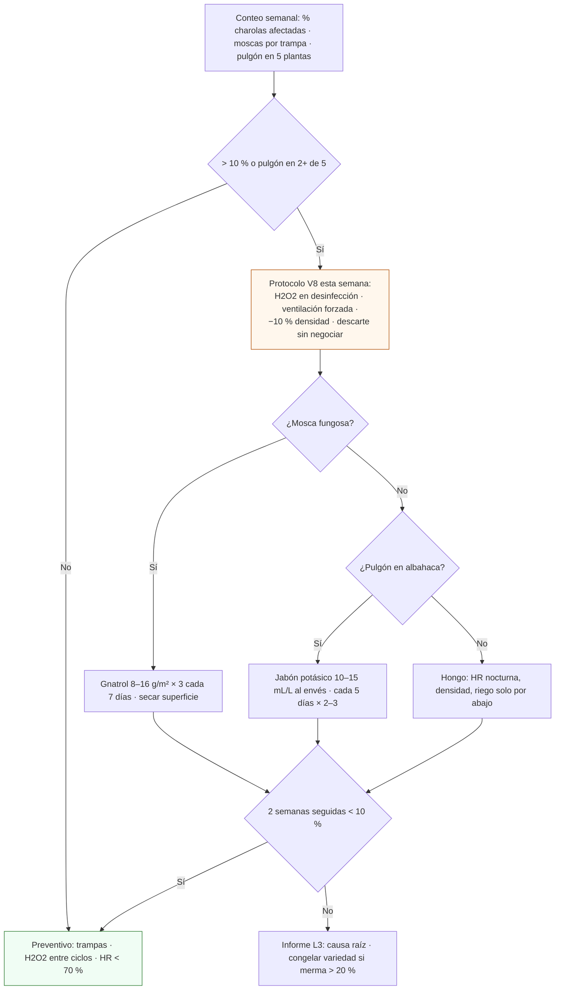

# V8 · Auditoría sanitaria (moho y plagas)

**En una línea:** una vez por semana, siempre el mismo día, cuentas cuántas charolas del rack tienen cualquier signo de hongo y cuántas de las 5 plantas marcadas de albahaca traen pulgón; si pasas del 10 % de charolas o de 2 plantas, el protocolo se dispara sin discusión: H2O2 en la desinfección, ventilación forzada, −10 % de densidad y la charola afectada a la basura.

!!! info "Antes de empezar"
    - **Cuándo:** **semanal**, desde la primera charola (Fase 0) hasta siempre; el mismo día (propuesta: lunes antes de sembrar, o domingo junto con los KPIs); también cuando merma L2 > 20 % · **Tiempo:** 15 min de conteo (+ 2 min diarios de inspección L1) · **Costo:** $0 el conteo; botiquín ~$600 (jabón potásico $250, trampas ~$150 aprox., H2O2) y Gnatrol ~$800 aprox. si toca actuar ([Control de plagas](../guias/control-de-plagas.md)) · **Personas:** 1
    - **Necesitas:** trampas amarillas numeradas (1 por rack o cada 5 m²), 5 plantas de albahaca marcadas con cinta (Fase 2), termohigrómetro o el histórico de HR de HA, bolsas para descarte, `bitacora/validacion/v08-sanitaria.csv`
    - **Guías relacionadas:** [Control de plagas](../guias/control-de-plagas.md) · [Lavar y desinfectar charolas](../guias/lavar-y-desinfectar-charolas.md) · [Sembrar una charola](../guias/sembrar-una-charola.md) · **Desbloquea:** seguir sembrando la variedad; merma L2 en verde; una entrega que no se rechaza

## Propósito

Entre junio y septiembre la HR de 70–89 % convierte cualquier túnel cerrado en incubadora de moho, damping-off y botrytis ([research/clima-agronomia](../research/clima-agronomia.md)); en primavera el pulgón llega a la albahaca. La merma realista en régimen es 10–20 % de charolas sembradas, y el año 1, 20–25 % ([07 §6](../referencia/07-puntos-ciegos-y-riesgos.md)). El costo de una charola es ruido; el de una entrega rechazada por moho, no ([06 §V8](../referencia/06-validacion-y-lazos-agenticos.md)). El conteo semanal convierte "se ve bien" en un porcentaje con umbral.

## Qué cuenta como signo

| Cuenta como afectada | No cuenta |
|---|---|
| Pelusa **azul, verde o negra** sobre sustrato o semilla; "telaraña" gris; olor fétido; plántulas dobladas en la base (damping-off); manchas de fusarium | Pelos radiculares **blancos y uniformes** al destape (son raíces, no moho) |
| Mosquitos negros que salen al mover la charola (mosca fungosa), larvas en el coco | Una mosca en la trampa |
| Pulgón, melaza pegajosa, hojas deformadas en las plantas marcadas | Hojas amarillas por falta de luz |

## Procedimiento

1. **Fija el día y el denominador.** Cada semana, el mismo día: el denominador es **todas las charolas que están en el rack ese día** (en oscuridad, destapadas y en desarrollo), no las sembradas en la semana. *Criterio de listo:* número de charolas en rack contado antes de empezar.
2. **Recorre los 5 niveles con las charolas en la mano** (levántalas: la mosca fungosa y el moho de fondo se ven al mover). Marca cada charola afectada con una cruz en el masking. *Criterio de listo:* cada charola vista por arriba y por abajo.
3. **Descarta al momento** la afectada: bolsa cerrada, fuera del área de producción hoy mismo; con fusarium nunca a la composta. En `bitacora/produccion.csv`: `merma_pct = 100` (o el % perdido) y la causa en `observaciones` (`moho verde dia 6; tirada`). *Criterio de listo:* ninguna charola marcada sigue en el rack al terminar.
4. **Cuenta las trampas:** moscas por trampa numerada; anota y cambia la trampa cuando esté saturada. *Criterio de listo:* un número por trampa, comparable con la semana anterior.
5. **Fase 2: pulgón en las 5 plantas marcadas de albahaca** (revisa el envés): número de plantas con pulgón, de 5. *Criterio de listo:* `pulgon_plantas_de_5` anotado.
6. **Lee la HR máxima de la semana** en HA (o en el termohigrómetro) y los ciclos de ventilación. *Criterio de listo:* `hr_max_semana_pct` anotado.
7. **Calcula y compara con el umbral:** `pct_afectadas = afectadas ÷ en_rack × 100`. Umbral: **> 10 %** o **pulgón en 2 o más de 5**. *Criterio de listo:* `umbral_disparado` = `si` / `no`.
8. **Si se disparó, ejecuta el protocolo completo esa semana** ([Control de plagas](../guias/control-de-plagas.md)): H2O2 3 % en la desinfección de charolas, tijeras y mesa (doble pasada a las que tuvieron moho); ventilación forzada (HR < 70 %, forzado 10 min/h en lluvias); bajar densidad de siembra 10 % en las charolas nuevas; descarte sin negociar; si hay mosca fungosa, Gnatrol 8–16 g/m² × 3 cada 7 días y secar la superficie entre riegos; si hay pulgón en albahaca, jabón potásico 10–15 mL/L al envés cada 5 días × 2–3. *Criterio de listo:* acciones con fecha en la fila; nada de "a ver la próxima semana".
9. **Semana siguiente: repite.** Sales del protocolo con **dos semanas seguidas** bajo el 10 % y sin pulgón en 2+. Si no baja, sube el caso al informe L3 y revisa densidad, riego por abajo y HR nocturna. *Criterio de listo:* dos filas seguidas con `umbral_disparado = no`.

## Criterio de aceptación

!!! example "La semana pasa si"
    - **≤ 10 %** de las charolas en rack tienen cualquier signo de hongo (conteo hecho, no estimado).
    - Pulgón en **menos de 2** de las 5 plantas marcadas de albahaca (Fase 2).
    - Toda charola afectada fue **descartada el mismo día** y está en `bitacora/produccion.csv` con su causa.

    **> 10 %** o **pulgón en 2+ plantas** dispara el protocolo (H2O2 + ventilación forzada + −10 % de densidad + descarte); y **merma L2 > 20 %** congela la variedad nueva y obliga a correr V8 con revisión de densidad ([06 §L2](../referencia/06-validacion-y-lazos-agenticos.md)).



## Plantilla de registro

`bitacora/validacion/v08-sanitaria.csv` (una fila por semana):

```csv
fecha,semana,fase,charolas_en_rack,charolas_afectadas,pct_afectadas,tipo_signo,moscas_por_trampa,pulgon_plantas_de_5,hr_max_semana_pct,umbral_disparado,accion,observaciones
2026-10-05,2026-W41,0,10,0,0,,2,,71,no,preventivo,"trampa T1 cambiada; rack bajo techo"
2027-07-05,2027-W27,2,32,4,12.5,"moho verde N5 (3) · damping-off arugula N3 (1)","T1 18 · T2 9",1,86,si,"H2O2 doble pasada; forzado 10 min/h activado; girasol a 120 g; 4 charolas tiradas; Gnatrol 1a de 3","lluvias: HR 86 % 3 noches seguidas; revisar cortina sur"
2027-07-12,2027-W28,2,30,2,6.7,"moho N5 (2)","T1 7 · T2 4",0,79,no,"Gnatrol 2a de 3; sigue forzado","bajo del umbral; falta 1 semana mas para salir del protocolo"
2027-07-19,2027-W29,2,31,1,3.2,"moho N5 (1)","T1 3 · T2 2",0,74,no,"Gnatrol 3a de 3; preventivo","2 semanas < 10 %: fuera del protocolo"
```

- `tipo_signo`: qué y dónde (nivel), para que el informe L3 vea patrones (siempre N5 = oscuridad y peso; siempre una variedad = densidad o semilla sucia).
- Las charolas descartadas van también en `bitacora/produccion.csv` con `merma_pct` y causa: de ahí sale el KPI de merma ([KPIs](kpis.md)).

## Si falla

| Patrón en el CSV | Causa probable | Qué hacer |
|---|---|---|
| Moho concentrado en N5 (oscuridad) | Peso excesivo o charolas sin aire; semilla sin sanitizar; remojo > 12 h sin cambiar agua | Sanitizar siempre (H2O2 3 % 60 °C 5 min); cambiar agua de remojo; atomizar menos en oscuridad ([Sanitizar semilla](../guias/sanitizar-semilla.md)) |
| Moho en una sola variedad | Densidad alta para la temporada o semilla "sucia" del lote | −10 % de densidad; [V1](v01-germinacion.md) al lote; considerar cambiar de costal |
| Moho en todas partes en lluvias | HR nocturna > 75 % sostenida; ventilador sin banda ni forzado | Revisar el lazo de ventilación ([Control · Lazo 3](../diseno/control.md)); riego solo por abajo; alarma "HR alta 6 h" activa |
| Mosca fungosa creciente | Sustrato usado acumulado; superficie siempre mojada | Sustrato usado fuera el mismo día; secar superficie entre riegos; Gnatrol comprado **antes** de junio ([07 §12](../referencia/07-puntos-ciegos-y-riesgos.md)) |
| Pulgón en albahaca en primavera | Sin preventivo quincenal | Jabón potásico preventivo quincenal marzo–mayo; Nufar como variedad principal |
| Dos semanas en protocolo sin bajar | Causa no corregida (rociar sin arreglar HR/densidad) | Congelar la variedad; informe L3 con el CSV; revisar el túnel (cortinas, malla) |
| Merma L2 > 20 % con V8 "limpio" | Charolas se tiran por otra causa (secas, estiradas) o no se registran | Cruzar `produccion.csv`: la merma tiene causa en `observaciones`; si es riego, [V5](v05-ausencia.md); si es luz, [Rack y charolas](../diseno/rack-y-charolas.md) |

!!! warning "Errores típicos"
    - Confundir raíces blancas con moho y tirar charolas buenas — o "esperar a ver" con pelusa verde.
    - Contar solo las charolas "sospechosas" y no todas las del rack (el denominador se infla y el % se desinfla).
    - Rociar sin corregir HR, densidad y riego: la plaga vuelve a la semana.
    - Rodenticida o insecticida "de ferretería" cerca del producto: un chef lo huele y un verificador lo anota (NOM-251).
    - No registrar el %: sin número no hay umbral, y sin umbral cada decisión es una corazonada.

## Al terminar

- [ ] Conteo hecho el mismo día de la semana, con todas las charolas del rack como denominador
- [ ] Charolas afectadas descartadas hoy, con `merma_pct` y causa en `produccion.csv`
- [ ] Fila en `bitacora/validacion/v08-sanitaria.csv` con `%`, trampas, pulgón, HR y `umbral_disparado`
- [ ] Si se disparó: protocolo completo con fecha; siguiente conteo en el calendario
- Registrar: la fila semanal; en Fase 2 el conteo de pulgón entra al panel de excepciones del lunes
- Siguiente paso: [Lavar y desinfectar charolas](../guias/lavar-y-desinfectar-charolas.md) (doble pasada a las que tuvieron moho); [KPIs](kpis.md) el domingo con la merma de la semana

## Fuentes

- [06 · Validación §V8, §L1, §L2](../referencia/06-validacion-y-lazos-agenticos.md): % de charolas con hongo y pulgón en 5 hojas marcadas, umbral > 10 % / 2+ plantas, protocolo (H2O2, ventilación, −10 % densidad, descarte), merma > 20 % → congelar variedad y correr V8.
- [07 · Puntos ciegos §6 y §12](../referencia/07-puntos-ciegos-y-riesgos.md): merma realista 10–20 % (año 1: 20–25 %), sustrato usado y mosca fungosa.
- [Guía · Control de plagas](../guias/control-de-plagas.md): plagas de la CDMX, dosis (Gnatrol 8–16 g/m² × 3; jabón potásico 10–15 mL/L), trampas, precios.
- [research/clima-agronomia](../research/clima-agronomia.md): calendario de riesgo (HR 70–89 % jun–sep; pulgón mar–may).
- [research/inocuidad-operativa §4](../research/inocuidad-operativa.md): control de fauna en NOM-251 (mallas, cero mascotas, trampas numeradas, nunca rodenticida en área de producto), fusarium fuera el mismo día.
