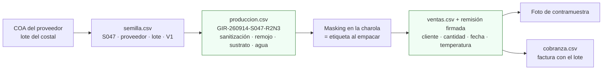

# V10 · Simulacro de retiro (mock recall)

**En una línea:** una vez al año eliges un lote al azar y demuestras con cronómetro, en menos de 2 horas, de qué costal de semilla salió y a qué clientes llegó, con remisiones firmadas y fotos; es la pregunta estándar de auditoría de hoteles y la única prueba de que la trazabilidad `VAR-AAMMDD-Slote-pos` funciona de verdad y no solo en la bitácora.

!!! info "Antes de empezar"
    - **Cuándo:** **una vez al año** con fecha en el calendario, y **antes de la primera auditoría o alta como proveedor** de un hotel, cadena o distribuidor; también tras cualquier cambio de formato de bitácora o de etiqueta · **Tiempo:** 2 h máximo cronometradas (meta real < 1 h) + 30 min de informe · **Costo:** $0 · **Personas:** 1; mejor 2 (uno elige el lote y cronometra, otro rastrea)
    - **Necesitas:** `bitacora/produccion.csv`, `semilla.csv`, `ventas.csv`, `cobranza.csv`; carpeta de remisiones firmadas; fotos de contramuestra por entrega; COA en `bitacora/coa/`; cronómetro; `bitacora/validacion/v10-mock-recall.csv`
    - **Guía paso a paso:** [Correr un simulacro de retiro](../guias/mock-recall.md) · **Desbloquea:** la carpeta de inocuidad de 8–10 páginas para hoteles con Distintivo H; alta como proveedor formal

## Propósito

Los microgreens de girasol y chícharo comparten riesgo con los germinados (remojo tibio de 8–24 h = incubadora si la semilla venía contaminada); el sector acumula recalls en EUA, y en México el paquete documental de un hotel incluye "descripción del sistema de lotes y política de retiro" ([research/inocuidad §1, §5, §6](../research/inocuidad-operativa.md); [07 §11](../referencia/07-puntos-ciegos-y-riesgos.md)). La trazabilidad que no se ensaya es una adivinanza el día que un chef llama. El simulacro mide el **sistema**, por eso el lote se elige al azar.



## Procedimiento (con el cronómetro corriendo)

1. **T+0 · Elige el lote al azar.** Un número entre 1 y el total de filas de `produccion.csv` de los últimos 60 días (dado, generador, "la fila 37"). Anota el `siembra_id` y arranca el cronómetro. *Criterio de listo:* código y hora de inicio escritos; nadie eligió un lote "cómodo".
2. **T+10 · Hacia atrás.** De la fila: `lote_semilla`, `densidad_g`, `dias_oscuridad`, y en `observaciones` sanitización (método, temperatura, minutos, operador), remojo, lote de coco, fuente de agua. En `semilla.csv`: proveedor, lote del proveedor, fecha de compra, V1, COA (abre el PDF). *Criterio de listo:* proveedor + lote del proveedor + COA (o "sin COA") en el informe.
3. **T+25 · Charolas hermanas.** Filtra `produccion.csv` por el mismo `lote_semilla`, después por la misma fecha de siembra (mismo coco, misma agua de remojo). Cuenta sembradas, cosechadas, descartadas, en rack, en refrigerador. *Criterio de listo:* tabla con cada charola hermana y su estado.
4. **T+45 · Hacia adelante.** Por cada charola vendida: `destino` y `precio_mxn`, la fila en `ventas.csv`, la remisión firmada (número, quién recibió, temperatura), la foto de contramuestra. *Criterio de listo:* cliente + fecha + remisión + foto por charola vendida; ninguna "sin destino".
5. **T+60 · Cuadre.** `sembradas = vendidas + descartadas + en existencia`. Si no cuadra, ese hueco es el hallazgo. *Criterio de listo:* ecuación escrita con los cuatro números.
6. **T+75 · Aviso a clientes** con el machote de la [guía](../guias/mock-recall.md) (no se manda, es simulacro): producto, lote, fechas, remisión, qué hacer. *Criterio de listo:* mensaje listo para copiar a cada cliente afectado.
7. **T+90 · Contención.** Qué charolas hermanas retirarías, qué muestra mandarías al laboratorio (Quibimex), si el costal se bloquea. *Criterio de listo:* tres decisiones escritas.
8. **T+120 máximo · Para el cronómetro e informa.** Tiempo total, huecos, acciones correctivas con fecha; informe en `bitacora/inocuidad/mock-recall-AAAA-MM-DD.md` y copia en la carpeta de inocuidad. *Criterio de listo:* informe guardado y fila en el CSV.
9. **Corrige lo que falló esta semana**, no el año que entra: remisiones sin lote, `destino` vacío, fotos sin fecha, costales sin COA. *Criterio de listo:* cada hueco con acción, fecha y responsable.

## Criterio de aceptación

!!! example "Aprobar el simulacro si"
    - El lote se eligió **al azar** y el rastreo completo (hacia atrás hasta proveedor + lote + COA; hacia adelante hasta cada cliente con remisión firmada y foto) tomó **< 2 horas** cronometradas.
    - **100 % de las charolas del costal ubicadas** y las cantidades **cuadran** (sembradas = vendidas + descartadas + existencia).
    - El informe está documentado en `bitacora/inocuidad/` y en la carpeta de inocuidad.

    Meta real con la bitácora bien llevada: < 1 hora. Si tardas más de 2 h o el cuadre no cierra, la trazabilidad **no funciona** aunque el CSV se vea lleno ([06 §V10](../referencia/06-validacion-y-lazos-agenticos.md)).

## Plantilla de registro

`bitacora/validacion/v10-mock-recall.csv` (una fila por simulacro; el informe largo va en `bitacora/inocuidad/mock-recall-AAAA-MM-DD.md` con el machote de la [guía](../guias/mock-recall.md)):

```csv
fecha,lote,seleccion,hora_inicio,hora_fin,minutos,costal,proveedor,lote_proveedor,coa,v1_pct,sembradas,vendidas,descartadas,existencia,cuadra,clientes_afectados,remisiones_ok,fotos_ok,huecos,acciones,resultado
2027-03-14,RAB-270228-S051-R1N3,"fila 37 de produccion.csv por dado",10:02,10:41,39,S051,Hydro Environment,2027-01-B04,si,91,18,15,2,1,si,"RestA (3; rem 0288-0290) · RestB (8; rem 0291-0294) · hogar H02 (4)",14/15,13/15,"1 remision sin temperatura; 2 fotos faltantes del 2027-03-02","campo temperatura obligatorio en talonario nuevo (esta semana); foto antes de firmar (SOP de reparto)",aprobado_con_hallazgos
2027-03-21,GIR-270301-S049-R2N4,"segundo simulacro tras corregir",09:30,09:58,28,S049,Mayoreo Online (CEDA),2027-02-C11,no,84,24,21,3,0,si,"RestA · RestC · H01 · H03",21/21,21/21,"costal sin COA (CEDA no lo entrega): mitigado con V1 y sanitizacion registrada","pedir COA o carta de lote a Al Natural para girasol de hoteles",aprobado
```

- `resultado`: `aprobado` · `aprobado_con_hallazgos` (cumple < 2 h y cuadra, pero hay huecos con acción) · `reprobado` (> 2 h o no cuadra).
- Las filas de `produccion.csv` con huecos se corrigen **sin borrar el original**: `observaciones` += "corregido en mock recall AAAA-MM-DD".

## Si falla

| Hallazgo | Causa | Corrección (esta semana) |
|---|---|---|
| > 2 h | Bitácora reconstruida de memoria; `destino` vacío; `siembra_id` distinto de la etiqueta | Regla de 30 s por evento el mismo día; masking desde la charola #1 ([Sembrar una charola](../guias/sembrar-una-charola.md)) |
| No cuadra | Charolas "a casa" o "muestra" sin fila; descartes sin `merma_pct` | `destino` obligatorio: cliente, `muestra`, `casa` o `basura` ([Datos §1](../diseno/datos.md)) |
| Remisión sin lote o sin firma | Talonario sin campo de lote | Talonario nuevo con lote y temperatura; sin firma no hay entrega demostrable ([Ruta de reparto](../guias/ruta-de-reparto.md)) |
| Costal sin `Sxxx` | Semilla "del mismo proveedor" tratada como un lote | Consecutivo el día que llega ([V1](v01-germinacion.md)) |
| Sin COA | El proveedor no lo emite (CEDA) | Mitigar con V1 + sanitización registrada; para hoteles, semilla con COA o carta de lote ([research/inocuidad §2](../research/inocuidad-operativa.md)) |
| Fotos faltantes | Se toman "cuando hay tiempo" | Foto de charolas + etiqueta **antes** de la firma, nombre con fecha; conservar 12 meses |
| Reprobado dos veces | El formato de lote no se usa en campo | Auditoría de 10 charolas al azar en el rack: masking vs CSV; corregir el SOP antes de repetir |

!!! warning "Errores típicos"
    - Elegir un lote "bonito": mides tu memoria, no tu sistema.
    - Hacerlo solo cuando el hotel lo pide: se hace con calendario; la auditoría te encuentra entrenado.
    - Mandar el aviso a clientes en un simulacro (es machote, no envío).
    - Borrar las filas con error en vez de corregirlas con nota.

## Al terminar

- [ ] Lote al azar; cronómetro < 2 h (meta < 1 h)
- [ ] Hacia atrás: costal, proveedor, lote del proveedor, COA, V1
- [ ] Hacia adelante: cada charola vendida con cliente, remisión firmada y foto
- [ ] Cuadre cerrado; huecos con acción y fecha
- [ ] Informe en `bitacora/inocuidad/` y fila en `bitacora/validacion/v10-mock-recall.csv`; copia en la carpeta de inocuidad
- Registrar: lo anterior; siguiente simulacro en 12 meses en el calendario
- Siguiente paso: armar o actualizar la carpeta de inocuidad (constancia fiscal, aviso COFEPRIS, laboratorio < 6 meses de [V7](v07-agua.md), fichas técnicas, política de retiro con este informe) — [guía §carpeta](../guias/mock-recall.md)

## Fuentes

- [06 · Validación §V10 y §esquema de datos](../referencia/06-validacion-y-lazos-agenticos.md): una vez al año, lote al azar, < 2 h, formato `VAR-AAMMDD-Slote-posición`, la bitácora como sensor.
- [research/inocuidad-operativa §1, §5, §6](../research/inocuidad-operativa.md): riesgo de girasol/chícharo, codificación de lote, campos por charola, contramuestra fotográfica, registros ≥ 12 meses, mock recall anual, FSMA 204, paquete documental de hoteles y Distintivo H, laboratorios.
- [07 · Puntos ciegos §11](../referencia/07-puntos-ciegos-y-riesgos.md): la trazabilidad como autoseguro; recalls del sector.
- [Guía · Mock recall](../guias/mock-recall.md): pasos con tiempos, machote de aviso, machote de informe, carpeta de inocuidad.
- [Diseño · Datos §1](../diseno/datos.md): `semilla.csv`, valores de `destino`, trazabilidad en dos sentidos.
